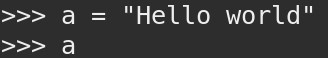
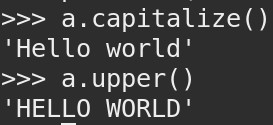
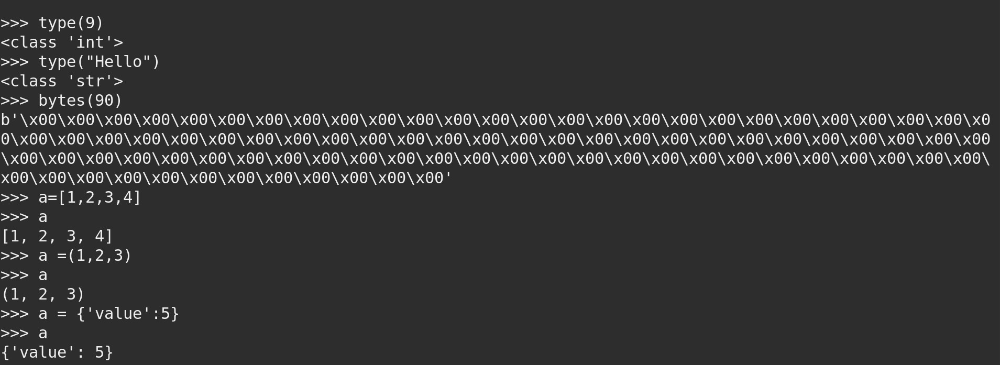
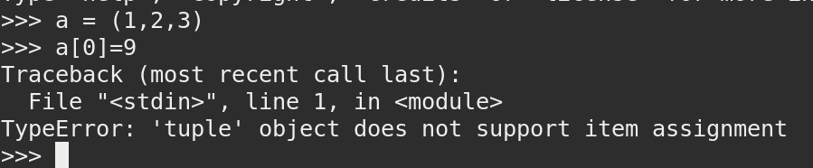
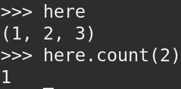
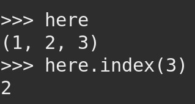
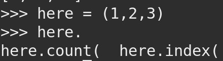

# Python Objects
Explain an easy way to understand the difference between objects and variables (example in console is a must)  

>A variable is a reserved memory location to store values  

  

>An object is a variable that has methods or properties to modify  

Provide 1 example of, at least 6 different Built-in types in python  

  

Show with an example how can you determine that an object is mutable and when an object it is not (console is a must)

  

Apply and explain at least 3 different attributes of the 6 different Built-in types mentioned below  
## Number  
### int.bit_length()  
Return the number of bits necessary to represent an integer in binary, excluding the sign and leading zeros: 
")  

### int.to_bytes(length, byteorder, *, signed=False)  
Return an array of bytes representing an integer  
")  

### int.from_bytes(bytes, byteorder, *, signed=False)
Return the integer represented by the given array of bytes  
")  

## String  
### string.capitalize()
Converts the first character to upper case  
")  

### string.endswith()
Returns true if the string ends with the specified value  
")  

### string.isalpha()
Returns True if all characters in the string are in the alphabet  
")  

## bytes  
### bytes.hex()
Returns hexadecimal value  
")  

### bytes.istitle()  
Check if each word start with an upper case letter  
")  

### bytes.isupper()  
Check if all the characters in the text are in upper case  
")  

## boolean
### boolean.bit_lenght()  
Return the number of bits necessary to represent an boolean in binary  
")  
### boolean.denominator()  
Returns the denominator of a rational number in lowest terms  

### boolean.real()  
Returns the real part of a complex number  
** Some of this method doesn't work properly so I cannot add screenshots

## List  
### list.append  
Append object to the end of the list  
")  

### list.count  
Return number of occurrences of value  
")  
### list.remove  
Remove first occurrence of value  
")  

## Tuples  
### tuple.count  
Return number of occurrences of value  
  
### tuple.index  
Return first index of value  
  
### tuple.
No more options  
  

## Dictionaries  
### dictionary.
### dictionary.
### dictionary.