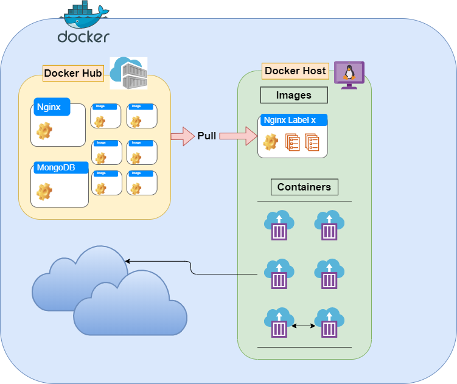

# Introduction to Docker

## What is Docker

    - Provides containers.
    - Provides resource isolation.
    - Avoids the problem of starting and maintaining VMs.
    - Reduce the use of disk, memory and servers. 
    - Promotes the scalability and high availability.
    
* Docker Community Edition

        Free Docker Version
* Docker Enterprise Edition

        Certified and support , image managment, Image Security

## What is a Container / Image

### [Image](https://www.docker.com/resources/what-container)

-   Container image is a lightweight, standalone, executable package of software that includes everything 
needed to run an application: code, runtime, system tools, system libraries and settings.
-   Images can be pulled from Docker Hub, imported from tar files or built using DockerFile.
    -   [DockerHub](https://www.docker.com/products/docker-hub)
    
       > Docker Hub is a hosted [repository](https://hub.docker.com/) service provided by Docker for finding and sharing container images 
        with your team.
        
-   Images are built using layers, every new layer append, change or remove files (functionality)
-   All the pulled or built images are stored in /var/lib/docker/${STORAGE_DRIVER}

### [Container](https://www.docker.com/resources/what-container)
-   Package Software into Standardized Units for Development, Shipment and Deployment.

-   A container is a standard unit of software that packages up code and all its dependencies
    so the application runs quickly and reliably from one computing environment to another.
    
-   Containers are isolated but they can share the Kernel from host, Libraries and binaries.

> Diagram 1  -  :point_up: Images and containers
>
>   Images are available to be pulled from DockerHub, they can be altered and then 
>   create multiple containers.
>   Please Note this is only to represent the basic concepts of images and containers, is not the 
>   fully Docker Architecture which is explained in a different topic below.

