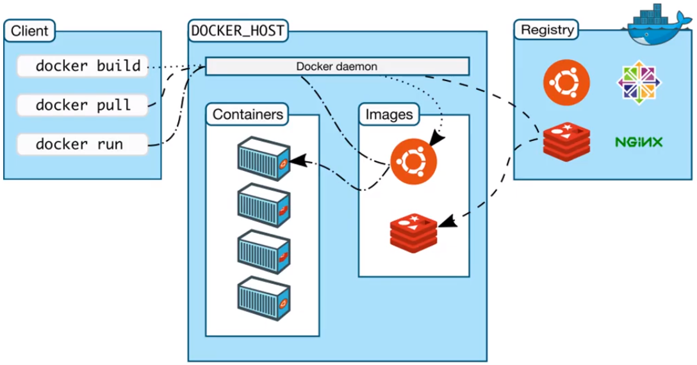
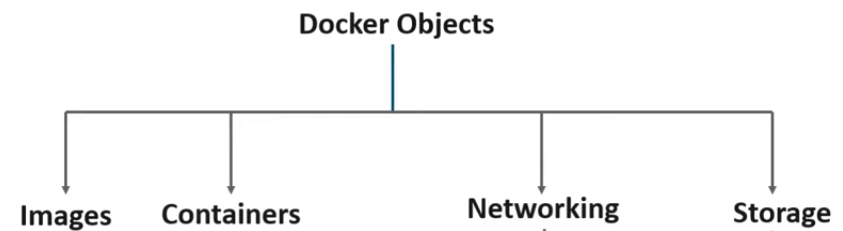

# Docker Architecture

* Client -> Server  Architecture.
* Lets you develop/build, ship and run applications.

#### Docker CLI / Docker Client
        Command Line Interface (execute Docker commands)
        /usr/bin/docker
####Docker Rest API
		Interface used to interact with Docker Daemon
####Docker Daemon
		Persistent background process, that manage Network, Images, Storage Volumes; it also it listen continuously
		for docker API Requests and process them.
####Repository
         * Group of public and private images.
         * This is used to push/pull new images or versions [DockerHub](https://www.docker.com/products/docker-hub).
         Images are pulled when they are not present in our local repository.

> Diagram 2  -  :point_up: Docker Architecture.

   Client communicates to Docker Daemon (which is normally running in a Linux Host)
   through [REST](https://en.wikipedia.org/wiki/Representational_state_transfer) [API](https://en.wikipedia.org/wiki/Application_programming_interface) which is listening continuously 
   for new requests (Docker commands) and manage all the Docker Objects.
   

> Diagram 3  -  :point_up: Docker Components.