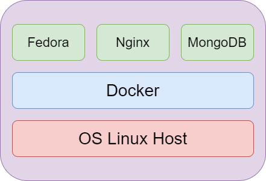
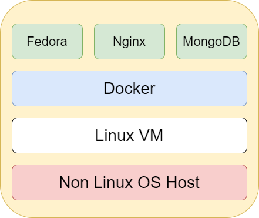

# Container VS Virtual Machine

Containers are fully isolated environments that could have their own processes
or services, network interfaces and mounts and all of them share the same OS Kernel.

* Docker Runs Natively in Linux Hosts.

> Diagram 6 
> Docker runs Natively in Linux Hosts

* Docker Runs in a VM in Windows Hosts. 

> Diagram 7 
> Docker runs over a Linux VM on non Linux Hosts

Main objective of Docker is not virtualize different OS in the same HW as Hypervisors
the main purpouse of Docker is package your application and run it many times as you need.

* Docker Desktop for Windows

[Docker Desktop](https://www.docker.com/products/docker-desktop) is a native Windows application that provides an easy-to-use development environment for building,
shipping, and running dockerized apps. 