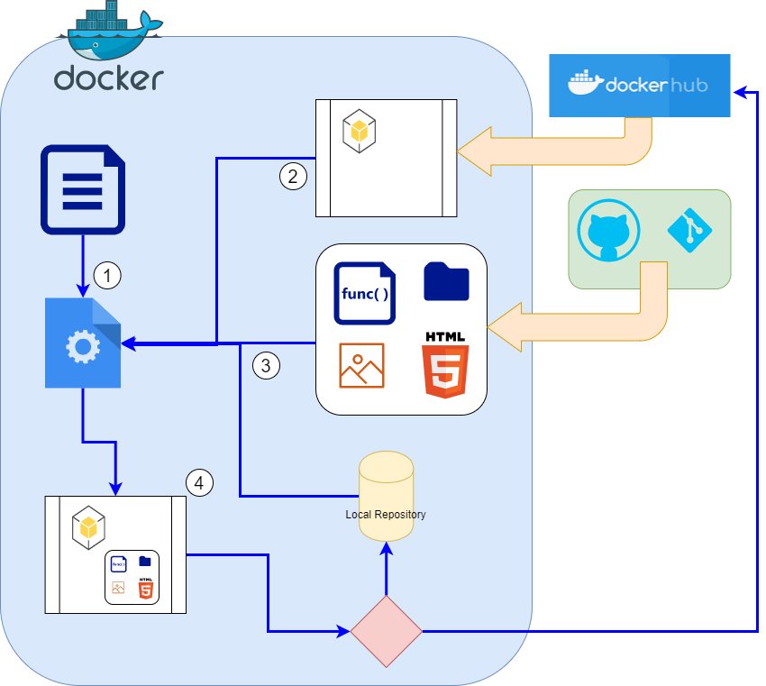

# Docker File

#### Please refer to the official documentation for docker file
https://docs.docker.com/engine/reference/builder/

#### Docker File Commands

|Command     | Description |
|----------- | --------------------------------------- |
|FROM        | Sets the base image for subsequent|
|MAINTAINER  |      Sets the author field of the generated images|
|RUN         | Execute commands in a new layer on top of the current image and commit the results|
|CMD         | Allowed only once (if many then last one takes effect)|
|LABEL       | Adds metadata to an image|
|EXPOSE      |  Informs container runtime that the container listens on the specified network ports at runtime|
|ENV         | Sets an environment variable|
|ADD         | Copy new files, directories, or remote file URLs from into the filesystem of the container|
|COPY        | Copy new files or directories into the filesystem of the container|
|ENTRYPOINT  |      Allows you to configure a container that will run as an executable|
|VOLUME      | Creates a mount point and marks it as holding externally mounted volumes from native host or other containers|
|USER        | Sets the username or UID to use when running the image|
|WORKDIR     | Sets the working directory for any RUN, CMD, ENTRYPOINT, COPY, and ADD commands|
|ARG         | Defines a variable that users can pass at build-time to the builder using --build-arg|
|ONBUILD     | Adds an instruction to be executed later, when the image is used as the base for another build|
|STOPSIGNAL  | Sets the system call signal that will be sent to the container to exit|

#### How it works

1.  DockerFile is created to create a cutomized image ( alter an existing image )
2.  An Existing image is pulled from Docker hub or local repository.
3.  Normally the COPY command is used to include your project files ( scripts, HTML, Images, Full Directory Structures )
4.  A new Image is created and it can be pulled to docker hub or your local repository.

   
   