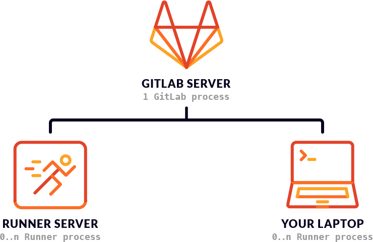

# GITLAB CI


### GitLab CI/CD 

is a part of GitLab, a web application with an API that stores its state in a database. It manages projects/builds and provides a nice user interface, besides all the features of GitLab.



### GitLab Runner 

To perform the actual build, you need to install GitLab Runner which is written in Go.
It can run on any platform for which you can build Go binaries, including Linux, OSX, Windows, FreeBSD and Docker.
It can test any programming language including .Net, Java, Python, C, PHP and others.
GitLab Runner has many features, including autoscaling, great Docker support, and the ability to run multiple jobs concurrently. 

#### Shared Runners 

are useful for jobs that have similar requirements, between multiple projects. Rather than having multiple Runners idling for many projects, you can have a single or a small number of Runners that handle multiple projects. This makes it easier to maintain and update them. Shared Runners process jobs using a fair usage queue. In contrast to specific Runners that use a FIFO queue, this prevents cases where projects create hundreds of jobs which can lead to eating all available shared Runners resources.

#### Specific Runners 

are useful for jobs that have special requirements or for projects with a specific demand. If a job has certain requirements, you can set up the specific Runner with this in mind, while not having to do this for all Runners. For example, if you want to deploy a certain project, you can set up a specific Runner to have the right credentials for this. The usage of tags may be useful in this case. Specific Runners process jobs using a FIFO queue.

#### Group Runners 

are useful when you have multiple projects under one group and would like all projects to have access to a set of Runners. Group Runners process jobs using a FIFO queue.

### .gitlab-ci.yml

The `.gitlab-ci.yml` file is where you configure what CI does with your project. It lives in the root of your repository.
On any push to your repository, GitLab will look for the .gitlab-ci.yml file and start jobs on Runners according to the contents of the file, for that commit.

Because `.gitlab-ci.yml` is in the repository and is version controlled, old versions still build successfully, forks can easily make use of CI, branches can have different pipelines and jobs, and you have a single source of truth for CI.


`image:` 

```
image: test:11.03.01

```

`stages:`

```
stages:
  - test
  - build
  - deploy
```

`before_script`

```
before_script:
  - apt-get install rubygems ruby-dev -y

run-test:
  script:
    - ruby --version
```

`script:`
```
 build:
   image: $CI_REGISTRY/group/project/docker:19.03.1
   services:
     - name: $CI_REGISTRY/group/project/docker:19.03.1-dind
       alias: docker
   stage: build
   script:
     - docker build -t my-docker-image .
     - docker run my-docker-image /script/to/run/tests
```

`environment:`
```
  environment:
    name: staging
```

`services:`
```
image: docker:19.03.1
services:
  - docker:19.03.1-dind
```

`only:`

```
deploy_production:
  stage: deploy
  script:
    - echo "Deploy to production server"
  environment:
    name: production
    url: https://production.example.com
  only:
  - master
```

```
image: test:11.03.01

stages:
  - test
  - build
  - deploy

test:
  stage: test
  script: echo "Running tests"

build:
  stage: build
  script: echo "Building the app"

deploy_staging:
  stage: deploy
  script:
    - echo "Deploy to staging server"
  environment:
    name: staging
    url: https://staging.example.com
  only:
  - master
```