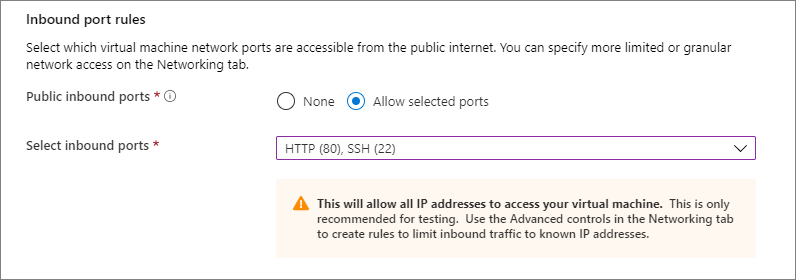

# Microsoft Azure
# 02 - Creating a Virtual Machine

### Instructions
- Type **virtual machines** in the search.
- Under **Services**, select **Virtual machines**.
- In the **Virtual machines** page, select **Add**. The **Create a virtual machine** page opens.
- In the **Basics** tab, under **Project details**, make sure the correct subscription is selected and then choose to **Create new** resource group. Type *myResourceGroup* for the name.*.


- Under **Instance details**, type *myVM* for the **Virtual machine name**, choose *East US* for your **Region**, and choose Ubuntu *18.04 LTS* for your **Image**. Leave the other defaults.


- Under **Administrator account**, select **SSH public key**, type your user name, then paste in your public key. Remove any leading or trailing white space in your public key.


- Under **Inbound port rules > Public inbound ports**, choose **Allow selected ports** and then select **SSH (22)** and **HTTP (80)** from the drop-down.

Remember that if you're working with RDP the corresponding port is **3389**



- Leave the remaining defaults and then select the **Review + create** button at the bottom of the page.

- On the **Create a virtual machine** page, you can see the details about the VM you are about to create. When you are ready, select **Create**.

## Connect to virtual machine
- Create an SSH connection with the VM.
    - Select the **Connect** button on the overview page for your VM.
    
    

    - In the **Connect to virtual machine** page, keep the default options to connect by IP address over port 22. In **Login using VM local account** a connection command is shown. Select the button to copy the command. The following example shows what the SSH connection command looks like:

    ```
    ssh azureuser@10.111.12.123
    ```
## Install web server

- To see your VM in action, install the NGINX web server. From your SSH session, update your package sources and then install the latest NGINX package.
    
```
sudo apt-get -y update
sudo apt-get -y install nginx
```
- When done, type exit to leave the SSH session.

## View the web server in action

- Use a web browser of your choice to view the default NGINX welcome page. Type the public IP address of the VM as the web address. The public IP address can be found on the VM overview page or as part of the SSH connection string you used earlier.


## Clean up resources

When no longer needed, you can delete the resource group, virtual machine, and all related resources. To do so, select the resource group for the virtual machine, select **Delete**, then confirm the name of the resource group to delete.

### Expected deliverables
- MD file with each activity
- Documentation of procedures, include images if needed

### Evaluation

| Metric name        | Metric description                                | % Value |
|:------------------ |:--------------------------------------------------|:--:|
| MD format  | Clearity and completeness procedure | 10% |
| VM Creation | Deploy a simple virtual machine, create Network Security Group and rule | 60% |
|Web Server installed | You must have a web server installed and running | 30%|
