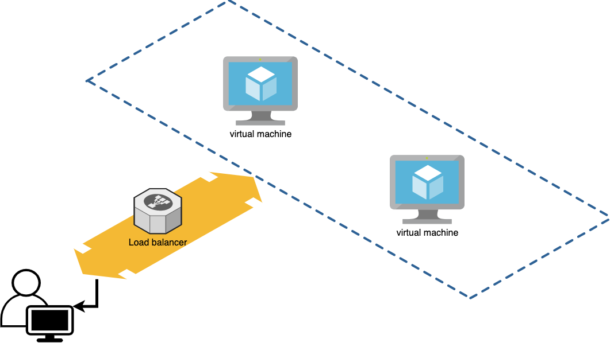
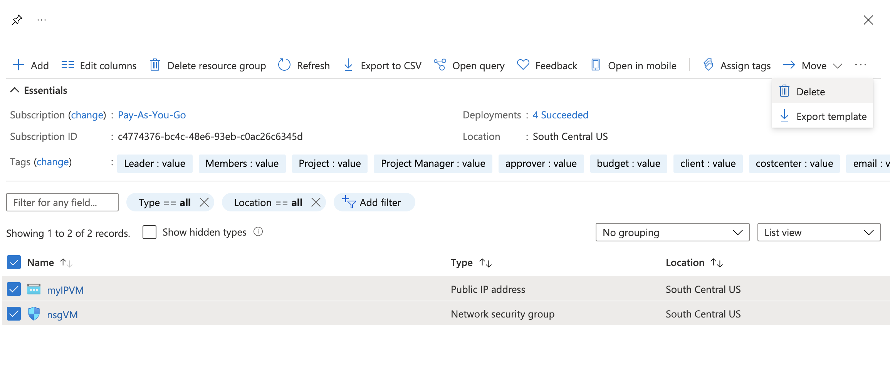
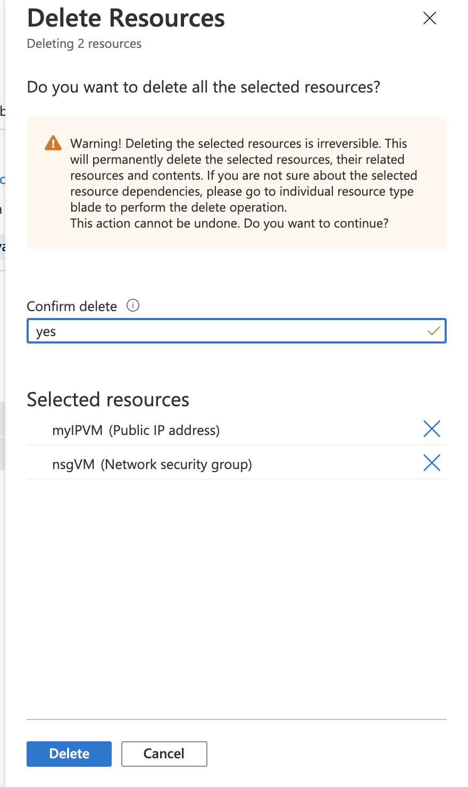

# Microsoft Azure
# 03 - First Azure Infrastructure

### Instructions
* To complete this activity, you should create two virtual machines, and both are them should be connected with a Load Balancer.

* Furthermore, the virtual machines must have an installation of one of the next tools:
    - Jenkins
    - Gitlab

For this, you can choose to install manually or with a script after creation, or include it with custom-data script in the creation process.

The activity must create an infrastructure that looks like the following diagram:

### Useful links:
- [Load Balancer](https://docs.microsoft.com/en-us/azure/load-balancer/load-balancer-overview)
- [Tutorial](https://docs.microsoft.com/en-us/azure/load-balancer/quickstart-load-balancer-standard-public-portal?tabs=option-1-create-load-balancer-standard)
- [Sandbox](https://docs.microsoft.com/en-us/learn/modules/improve-app-scalability-resiliency-with-load-balancer/4-exercise-configure-public-load-balancer?pivots=bash)
- [Gitlab installation](https://about.gitlab.com/install/#centos-8)
- [Jenkins installation](https://www.jenkins.io/doc/book/installing/linux/)

## Deliverables

Upload a MD file with the following content:

* Document the commands that you used to achieve the instructions. (both azure cli commands and installing the tool)
* Take a screenshot of the outputs commands that you used
* Take a screenshot of the resources in your resource group in the portal
* Login via ssh to both machines and take a screnshot of the prompt
* Explain how did you install the tool (after creation or with custom-data and why)
* Screenshot of the tool working in the browser using your public IP.

## Clean up resources

Don't forget to delete your resources when the activity had done. Use the [portal](https://portal.azure.com/)

Select your resource

Confirm the deletion

### Evaluation

| Metric name        | Metric description                                | % Value |
|:------------------ |:--------------------------------------------------|:--:|
| MD format  | Documentation of the commands used for az cli resources | 10% |
| MD format  | Screenshots of the output of az cli commands are included | 10% |
| MD format  | Documentation of the commands used to install the tool | 10% |
| MD format  | Documentation of the method chosen to install the tool | 10% |
| Mini infrastructure | Screenshot of the prompt of the 2 VMs, proof that you could login and they existed | 15% |
| Mini infrastructure | Screenshot of the resources created in the portal | 15% |
| Mini infrastructure | screenshot of the Web tool installed and working in the browser with public IP visible | 15% |
| Mini infrastructure | Output of Public IP of the LB, and public IP in the screenshot matches |15% |

