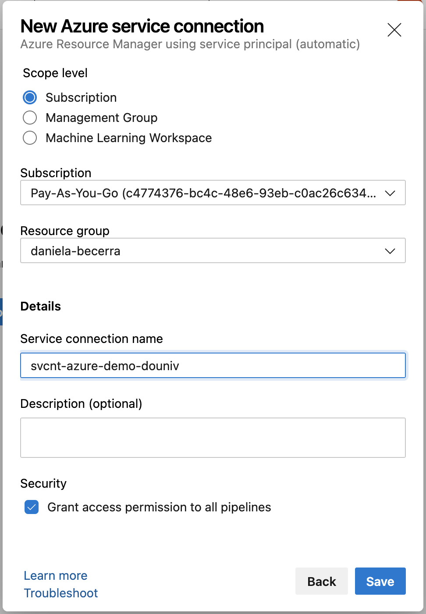
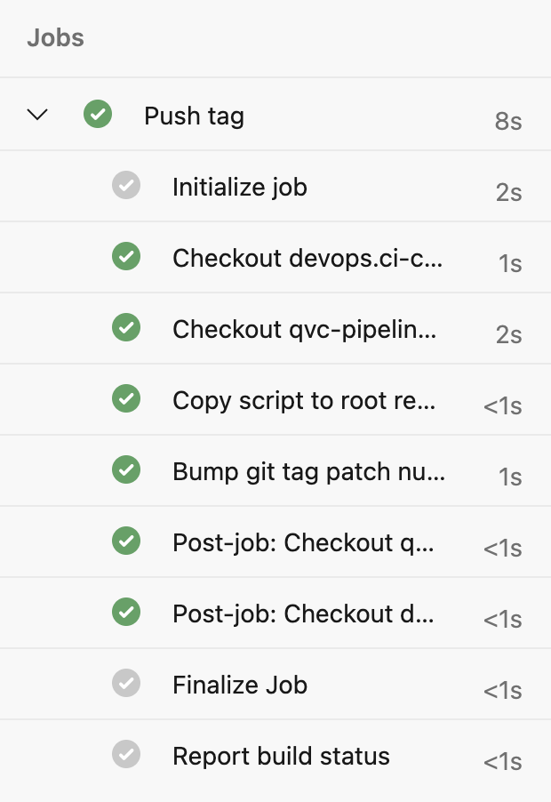
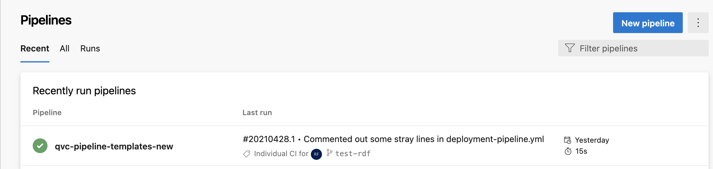

# Microsoft Azure
# 04 - Azure Pipelines

Create a pipeline that spins up the resources that you created in activity 03.

For this, first delete all the resources that you already have, so you can start again.

## Baby pipeline

First create the infrastructure/framework needed to use pipelines connected with Azure. You can test by just creating a simple resource (only a VM, only a storage account, or only a vnet, etc)

1. Login to azure pipelines with your dou email

2. Enter danielabecerra organization and douniversity2021 project

3. You can create a Repo inside here, or create a repo in github and link it later. If you make a repo inside, label it with your name and then the name of the repo. (example: daniela-baby-pipeline)

4. - Choose, Pipelines/create  pipeline. 
   - Choose if you have an existing repo in github or in azure devops. 
   - Choose basic template (it should have an `echo hello world` step)
   - Save and run. Now you have a *fetus* pipeline!

5. Go to project settings / Pipeliens / Service connections / Create service connection
    * Select Azure resource manager
    * Select service principal (automatic)
    * choose your resource-group
    * name it something that makes sense and write it down
    * Leave the pipelines permission checkmark marked
    * click save

6. Clone your repo in your local machine or pull the latest changes so you have the `azure-pipelines.yml` file
and edit one of the steps, or add a new step to make it look something like this. It may have more things, but you will need the entries **azureSubscription** for sure

        steps:
        - task: AzureCLI@2
        displayName: 'Create a simple resource in azure'
        inputs:
            azureSubscription: REPLACE THIS WITH YOUR SERVICE CONNECTION FROM STEP 5
            scriptType: bash
            scriptLocation: inlineScript
            inlineScript: |
            az storage account create --resource-group $(RG_NAME) --name $(STORAGE_NAME) --sku Standard_LRS 
            addSpnToEnvironment: true
            useGlobalConfig: true

    * Now you have your baby pipeline, that actually does something!

## Real pipeline

**Improvements**

To port what you have from activity 3, it's more than one line script, so you could:
-  include a separate script file in the repo, and execute the file in the pipeline.
* Execute all the az cli commands directly in the pipeline.yml file

Example of calling a script:

1. The checkout step will copy the files of your repo to the pipeline workspace

        steps:
        - checkout: git://projectname/RepoName@refs/heads/RepoBranch
            path: scriptFolder
            fetchDepth: 2
        # the same thing
        - checkout: self
            path: script folder
            fetchDepth: 2

        - script: |
            chmod +x myscript.sh
            ./myscript.sh
            workingDirectory: $(Pipeline.Workspace)/scriptFolder/scripts
            displayName: "Run my script"

2. If you decide to keep the az cli commands directly in the pipeline file, a good practice would be to separate the tasks in steps, with displayNames, so when the pipeline is run, it's easier to see what's going on, with a certain structure and order.

After creating all the resources with the pipeline, manually login to the hosts, and install the same application you did on activity 3. (Optional: the install can be part of the pipeline if you use custom-data attribute in the `vm create` command)

# Deliverables

Once you're done. Copy the code that you have in your repo for the Pipeline, and include it as a deliverable.

Take screenshots of
* Your service connection created
* Your repo in the browser, displaying the files that it has.
* A successful pipeline run 

* The jobs list in the terminal log of the pipeline
* The resources in your resource group, created by this pipeline
* The application running on the browser by entering your public IP of the load balancer.

### Evaluation

| Metric name        | Metric description                                | % Value |
|:------------------ |:--------------------------------------------------|:--:|
| Azure Devops | Service connection created screenshot | 10% |
| Azure Devops or Github | Repo screenshot in browser with visible file structure | 10% |
| Pipeline | Pipeline successful run screenshot | 15%|
|Pipeline  | Pipeline job list in the command log interface screenshot | 15%|
| Pipeline | Pipeline job output where the resources are created in the Azure devops pipeline terminal view in the browser. To prove the resources are created by the pipeline and not manually. If you split resources creation in several steps, one step screenshot is enough. | 15%|
| Pipeline | Your pipeline script  | 15% |
| Mini infrastructure | Screenshot of the azure portal with your resources created by the pipeline | 10% |
| Mini infrastructure | screenshot of the Web tool installed and working in the browser with public IP visible | 10% |
