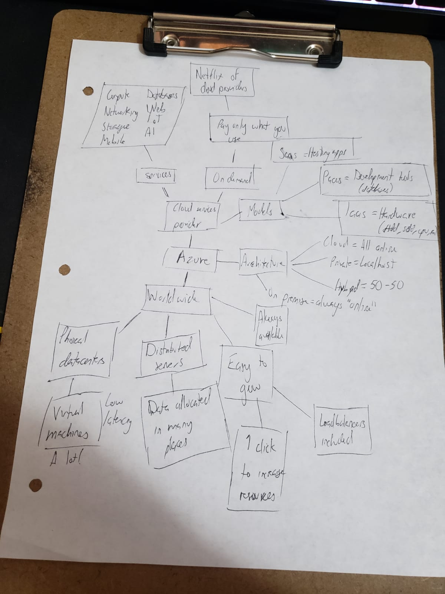
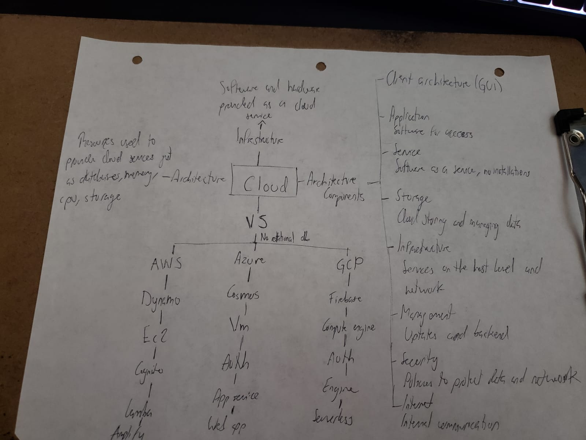

# 01 - Cloud Basic Concepts
Cloud Computing Mind Map  

https://www.teamnet.com.mx/blog/cloud-vs-on-premise  

https://www.digitalocean.com/community/tutorials/what-is-high-availability  

https://www.geeksforgeeks.org/scalability-and-elasticity-in-cloud-computing/  

Cloud resources  

https://www.upgrad.com/blog/components-of-cloud-computing-architecture/  

https://www.tutorialspoint.com/cloud_computing/cloud_computing_architecture.htm