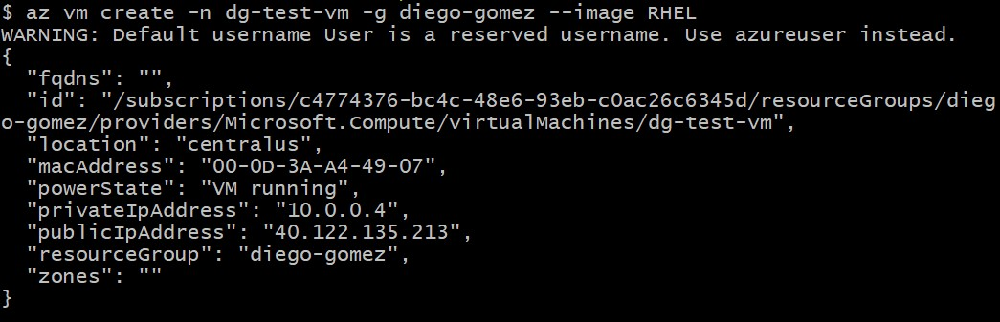
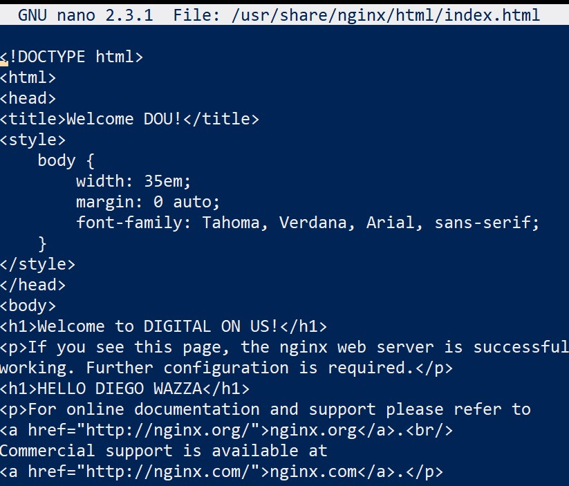
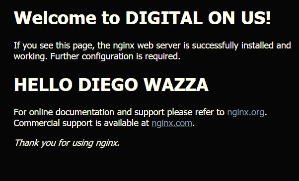

# Creating a Virtual Machine
## Document the commands that you used to achieve the instructions.  
Create vm
```
 az vm create -n dg-test-vm -g diego-gomez --image RHEL
WARNING: Default username User is a reserved username. Use azureuser ins
{
  "fqdns": "",
  "id": "/subscriptions/c4774376-bc4c-48e6-93eb-c0ac26c6345d/resourceGroo-gomez/providers/Microsoft.Compute/virtualMachines/dg-test-vm",
  "location": "centralus",
  "macAddress": "00-0D-3A-A4-49-07",
  "powerState": "VM running",
  "privateIpAddress": "10.0.0.4",
  "publicIpAddress": "40.122.135.213",
  "resourceGroup": "diego-gomez",
  "zones": ""
}
```
Open port 80
```
az vm open-port --port 80 --resource-group diego-gomez --name dg-test-vm
```
Login using screenshot
```
ssh azureuser@40.122.135.213
```
Install Nginx
```
sudo yum –y install nginx
```
Start Nginx Service
```
sudo systemctl start nginx
```
Configure Firewall to Allow Traffic
```
firewall-cmd --zone=public --permanent --add-service=http
firewall-cmd --zone=public --permanent --add-service=https
firewall-cmd --reload
```
## Take a screenshot of the output of when you run the vm create command.  

## Modify the html file for nginx to include your name in the welcome page  

## Take a screenshot of the webpage in your browser, displaying your modified html landing page.
