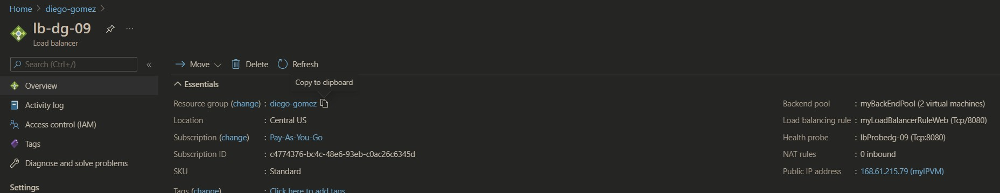

# Lb azure
Documentation of the commands used for az cli resources
Create a new public IP address
```
az network public-ip create --resource-group diego-gomez --allocation-method Static --name lb-public-ip
{
  "publicIp": {
    "ddosSettings": null,
    "dnsSettings": null,
    "etag": "W/\"a0d435f2-c209-4630-bec2-5fb04c7a0fb5\"",
    "extendedLocation": null,
    "id": "/subscriptions/c4774376-bc4c-48e6-93eb-c0ac26c6345d/resourceGroups/diego-gomez/providers/Microsoft.Network/publicIPAddresses/lb-public-ip",
    "idleTimeoutInMinutes": 4,
    "ipAddress": "13.89.237.122",
    "ipConfiguration": null,
    "ipTags": [],
    "location": "centralus",
    "name": "lb-public-ip",
    "provisioningState": "Succeeded",
    "publicIpAddressVersion": "IPv4",
    "publicIpAllocationMethod": "Static",
    "publicIpPrefix": null,
    "resourceGroup": "diego-gomez",
    "resourceGuid": "161062a9-2fcf-419e-8fc9-1642f56ff6b0",
    "sku": {
      "name": "Basic",
      "tier": "Regional"
    },
    "tags": null,
    "type": "Microsoft.Network/publicIPAddresses",
    "zones": null
  }
}
```
Create the load balancer
```
 az network lb create --resource-group diego-gomez --name dg-lb --public-ip-address lb-public-ip --frontend-ip-name frontend-pool --backend-pool-name backend-pool
{
  "loadBalancer": {
    "backendAddressPools": [
      {
        "etag": "W/\"b72f2d39-61f1-4a5a-9884-ff9e36e3705b\"",
        "id": "/subscriptions/c4774376-bc4c-48e6-93eb-c0ac26c6345d/resourceGroups/diego-gomez/providers/Microsoft.Network/loadBalancers/dg-lb/backendAddressPools/backend-pool",
        "name": "backend-pool",
        "properties": {
          "provisioningState": "Succeeded"
        },
        "resourceGroup": "diego-gomez",
        "type": "Microsoft.Network/loadBalancers/backendAddressPools"
      }
    ],
    "frontendIPConfigurations": [
      {
        "etag": "W/\"b72f2d39-61f1-4a5a-9884-ff9e36e3705b\"",
        "id": "/subscriptions/c4774376-bc4c-48e6-93eb-c0ac26c6345d/resourceGroups/diego-gomez/providers/Microsoft.Network/loadBalancers/dg-lb/frontendIPConfigurations/frontend-pool",
        "name": "frontend-pool",
        "properties": {
          "privateIPAddressVersion": "IPv4",
          "privateIPAllocationMethod": "Dynamic",
          "provisioningState": "Succeeded",
          "publicIPAddress": {
            "id": "/subscriptions/c4774376-bc4c-48e6-93eb-c0ac26c6345d/resourceGroups/diego-gomez/providers/Microsoft.Network/publicIPAddresses/lb-public-ip",
            "resourceGroup": "diego-gomez"
          }
        },
        "resourceGroup": "diego-gomez",
        "type": "Microsoft.Network/loadBalancers/frontendIPConfigurations"
      }
    ],
    "inboundNatPools": [],
    "inboundNatRules": [],
    "loadBalancingRules": [],
    "probes": [],
    "provisioningState": "Succeeded",
    "resourceGuid": "5af737a4-4aee-48f9-af35-6238db850126"
  }
}
```
Create health probe
```
$ az network lb probe create -g diego-gomez --lb-name dg-lb --name dg-health-probe --protocol tcp --port 80
{
  "etag": "W/\"43ff363a-ff47-4a35-9392-6ece1eb0a642\"",
  "id": "/subscriptions/c4774376-bc4c-48e6-93eb-c0ac26c6345d/resourceGroups/diego-gomez/providers/Microsoft.Network/loadBalancers/dg-lb/probes/dg-health-probe",
  "intervalInSeconds": 15,
  "loadBalancingRules": null,
  "name": "dg-health-probe",
  "numberOfProbes": 2,
  "port": 80,
  "protocol": "Tcp",
  "provisioningState": "Succeeded",
  "requestPath": null,
  "resourceGroup": "diego-gomez",
  "type": "Microsoft.Network/loadBalancers/probes"
}
```
Lb rule
```
az network lb rule create -g diego-gomez --lb-name dg-lb --name HTTPrule --protocol tcp --frontend-port 80 --backend-port 80 --frontend-ip-name frontend-pool --backend-pool-name backend-pool --probe-name dg-health-probe
{
  "backendAddressPool": {
    "id": "/subscriptions/c4774376-bc4c-48e6-93eb-c0ac26c6345d/resourceGroups/diego-gomez/providers/Microsoft.Network/loadBalancers/dg-lb/backendAddressPools/backend-pool",
    "resourceGroup": "diego-gomez"
  },
  "backendPort": 80,
  "disableOutboundSnat": null,
  "enableFloatingIp": false,
  "enableTcpReset": false,
  "etag": "W/\"bf580a4c-6edb-49be-b05c-2c771b675670\"",
  "frontendIpConfiguration": {
    "id": "/subscriptions/c4774376-bc4c-48e6-93eb-c0ac26c6345d/resourceGroups/diego-gomez/providers/Microsoft.Network/loadBalancers/dg-lb/frontendIPConfigurations/frontend-pool",
    "resourceGroup": "diego-gomez"
  },
  "frontendPort": 80,
  "id": "/subscriptions/c4774376-bc4c-48e6-93eb-c0ac26c6345d/resourceGroups/diego-gomez/providers/Microsoft.Network/loadBalancers/dg-lb/loadBalancingRules/HTTPrule",
  "idleTimeoutInMinutes": 4,
  "loadDistribution": "Default",
  "name": "HTTPrule",
  "probe": {
    "id": "/subscriptions/c4774376-bc4c-48e6-93eb-c0ac26c6345d/resourceGroups/diego-gomez/providers/Microsoft.Network/loadBalancers/dg-lb/probes/dg-health-probe",
    "resourceGroup": "diego-gomez"
  },
  "protocol": "Tcp",
  "provisioningState": "Succeeded",
  "resourceGroup": "diego-gomez",
  "type": "Microsoft.Network/loadBalancers/loadBalancingRules"
}
```
Create subnet
```
az network vnet create -g diego-gomez -n dg-virtual-net --subnet-name dg-subnet
{
  "newVNet": {
    "addressSpace": {
      "addressPrefixes": [
        "10.0.0.0/16"
      ]
    },
    "bgpCommunities": null,
    "ddosProtectionPlan": null,
    "dhcpOptions": {
      "dnsServers": []
    },
    "enableDdosProtection": false,
    "enableVmProtection": null,
    "etag": "W/\"bc5d3f77-1e94-4745-b03f-de959a1f85da\"",
    "extendedLocation": null,
    "id": "/subscriptions/c4774376-bc4c-48e6-93eb-c0ac26c6345d/resourceGroups/diego-gomez/providers/Microsoft.Network/virtualNetworks/dg-virtual-net",
    "ipAllocations": null,
    "location": "centralus",
    "name": "dg-virtual-net",
    "provisioningState": "Succeeded",
    "resourceGroup": "diego-gomez",
    "resourceGuid": "a2ddcafb-079d-41ad-a0ea-89f07f19b1ea",
    "subnets": [
      {
        "addressPrefix": "10.0.0.0/24",
        "addressPrefixes": null,
        "delegations": [],
        "etag": "W/\"bc5d3f77-1e94-4745-b03f-de959a1f85da\"",
        "id": "/subscriptions/c4774376-bc4c-48e6-93eb-c0ac26c6345d/resourceGroups/diego-gomez/providers/Microsoft.Network/virtualNetworks/dg-virtual-net/subnets/dg-subnet",
        "ipAllocations": null,
        "ipConfigurationProfiles": null,
        "ipConfigurations": null,
        "name": "dg-subnet",
        "natGateway": null,
        "networkSecurityGroup": null,
        "privateEndpointNetworkPolicies": "Enabled",
        "privateEndpoints": null,
        "privateLinkServiceNetworkPolicies": "Enabled",
        "provisioningState": "Succeeded",
        "purpose": null,
        "resourceGroup": "diego-gomez",
        "resourceNavigationLinks": null,
        "routeTable": null,
        "serviceAssociationLinks": null,
        "serviceEndpointPolicies": null,
        "serviceEndpoints": null,
        "type": "Microsoft.Network/virtualNetworks/subnets"
      }
    ],
    "tags": {},
    "type": "Microsoft.Network/virtualNetworks",
    "virtualNetworkPeerings": []
  }
}
```
Create network security group
```
 az network nsg create -g diego-gomez -n dg-netw-security-group
{
  "NewNSG": {
    "defaultSecurityRules": [
      {
        "access": "Allow",
        "description": "Allow inbound traffic from all VMs in VNET",
        "destinationAddressPrefix": "VirtualNetwork",
        "destinationAddressPrefixes": [],
        "destinationApplicationSecurityGroups": null,
        "destinationPortRange": "*",
        "destinationPortRanges": [],
        "direction": "Inbound",
        "etag": "W/\"e21f7780-d6bb-4666-9d41-06aa6ac62fe0\"",
        "id": "/subscriptions/c4774376-bc4c-48e6-93eb-c0ac26c6345d/resourceGroups/diego-gomez/providers/Microsoft.Network/networkSecurityGroups/dg-netw-security-group/defaultSecurityRules/AllowVnetInBound",
        "name": "AllowVnetInBound",
        "priority": 65000,
        "protocol": "*",
        "provisioningState": "Succeeded",
        "resourceGroup": "diego-gomez",
        "sourceAddressPrefix": "VirtualNetwork",
        "sourceAddressPrefixes": [],
        "sourceApplicationSecurityGroups": null,
        "sourcePortRange": "*",
        "sourcePortRanges": [],
        "type": "Microsoft.Network/networkSecurityGroups/defaultSecurityRules"
      },
      {
        "access": "Allow",
        "description": "Allow inbound traffic from azure load balancer",
        "destinationAddressPrefix": "*",
        "destinationAddressPrefixes": [],
        "destinationApplicationSecurityGroups": null,
        "destinationPortRange": "*",
        "destinationPortRanges": [],
        "direction": "Inbound",
        "etag": "W/\"e21f7780-d6bb-4666-9d41-06aa6ac62fe0\"",
        "id": "/subscriptions/c4774376-bc4c-48e6-93eb-c0ac26c6345d/resourceGroups/diego-gomez/providers/Microsoft.Network/networkSecurityGroups/dg-netw-security-group/defaultSecurityRules/AllowAzureLoadBalancerInBound",
        "name": "AllowAzureLoadBalancerInBound",
        "priority": 65001,
        "protocol": "*",
        "provisioningState": "Succeeded",
        "resourceGroup": "diego-gomez",
        "sourceAddressPrefix": "AzureLoadBalancer",
        "sourceAddressPrefixes": [],
        "sourceApplicationSecurityGroups": null,
        "sourcePortRange": "*",
        "sourcePortRanges": [],
        "type": "Microsoft.Network/networkSecurityGroups/defaultSecurityRules"
      },
      {
        "access": "Deny",
        "description": "Deny all inbound traffic",
        "destinationAddressPrefix": "*",
        "destinationAddressPrefixes": [],
        "destinationApplicationSecurityGroups": null,
        "destinationPortRange": "*",
        "destinationPortRanges": [],
        "direction": "Inbound",
        "etag": "W/\"e21f7780-d6bb-4666-9d41-06aa6ac62fe0\"",
        "id": "/subscriptions/c4774376-bc4c-48e6-93eb-c0ac26c6345d/resourceGroups/diego-gomez/providers/Microsoft.Network/networkSecurityGroups/dg-netw-security-group/defaultSecurityRules/DenyAllInBound",
        "name": "DenyAllInBound",
        "priority": 65500,
        "protocol": "*",
        "provisioningState": "Succeeded",
        "resourceGroup": "diego-gomez",
        "sourceAddressPrefix": "*",
        "sourceAddressPrefixes": [],
        "sourceApplicationSecurityGroups": null,
        "sourcePortRange": "*",
        "sourcePortRanges": [],
        "type": "Microsoft.Network/networkSecurityGroups/defaultSecurityRules"
      },
      {
        "access": "Allow",
        "description": "Allow outbound traffic from all VMs to all VMs in VNET",
        "destinationAddressPrefix": "VirtualNetwork",
        "destinationAddressPrefixes": [],
        "destinationApplicationSecurityGroups": null,
        "destinationPortRange": "*",
        "destinationPortRanges": [],
        "direction": "Outbound",
        "etag": "W/\"e21f7780-d6bb-4666-9d41-06aa6ac62fe0\"",
        "id": "/subscriptions/c4774376-bc4c-48e6-93eb-c0ac26c6345d/resourceGroups/diego-gomez/providers/Microsoft.Network/networkSecurityGroups/dg-netw-security-group/defaultSecurityRules/AllowVnetOutBound",
        "name": "AllowVnetOutBound",
        "priority": 65000,
        "protocol": "*",
        "provisioningState": "Succeeded",
        "resourceGroup": "diego-gomez",
        "sourceAddressPrefix": "VirtualNetwork",
        "sourceAddressPrefixes": [],
        "sourceApplicationSecurityGroups": null,
        "sourcePortRange": "*",
        "sourcePortRanges": [],
        "type": "Microsoft.Network/networkSecurityGroups/defaultSecurityRules"
      },
      {
        "access": "Allow",
        "description": "Allow outbound traffic from all VMs to Internet",
        "destinationAddressPrefix": "Internet",
        "destinationAddressPrefixes": [],
        "destinationApplicationSecurityGroups": null,
        "destinationPortRange": "*",
        "destinationPortRanges": [],
        "direction": "Outbound",
        "etag": "W/\"e21f7780-d6bb-4666-9d41-06aa6ac62fe0\"",
        "id": "/subscriptions/c4774376-bc4c-48e6-93eb-c0ac26c6345d/resourceGroups/diego-gomez/providers/Microsoft.Network/networkSecurityGroups/dg-netw-security-group/defaultSecurityRules/AllowInternetOutBound",
        "name": "AllowInternetOutBound",
        "priority": 65001,
        "protocol": "*",
        "provisioningState": "Succeeded",
        "resourceGroup": "diego-gomez",
        "sourceAddressPrefix": "*",
        "sourceAddressPrefixes": [],
        "sourceApplicationSecurityGroups": null,
        "sourcePortRange": "*",
        "sourcePortRanges": [],
        "type": "Microsoft.Network/networkSecurityGroups/defaultSecurityRules"
      },
      {
        "access": "Deny",
        "description": "Deny all outbound traffic",
        "destinationAddressPrefix": "*",
        "destinationAddressPrefixes": [],
        "destinationApplicationSecurityGroups": null,
        "destinationPortRange": "*",
        "destinationPortRanges": [],
        "direction": "Outbound",
        "etag": "W/\"e21f7780-d6bb-4666-9d41-06aa6ac62fe0\"",
        "id": "/subscriptions/c4774376-bc4c-48e6-93eb-c0ac26c6345d/resourceGroups/diego-gomez/providers/Microsoft.Network/networkSecurityGroups/dg-netw-security-group/defaultSecurityRules/DenyAllOutBound",
        "name": "DenyAllOutBound",
        "priority": 65500,
        "protocol": "*",
        "provisioningState": "Succeeded",
        "resourceGroup": "diego-gomez",
        "sourceAddressPrefix": "*",
        "sourceAddressPrefixes": [],
        "sourceApplicationSecurityGroups": null,
        "sourcePortRange": "*",
        "sourcePortRanges": [],
        "type": "Microsoft.Network/networkSecurityGroups/defaultSecurityRules"
      }
    ],
    "etag": "W/\"e21f7780-d6bb-4666-9d41-06aa6ac62fe0\"",
    "flowLogs": null,
    "id": "/subscriptions/c4774376-bc4c-48e6-93eb-c0ac26c6345d/resourceGroups/diego-gomez/providers/Microsoft.Network/networkSecurityGroups/dg-netw-security-group",
    "location": "centralus",
    "name": "dg-netw-security-group",
    "networkInterfaces": null,
    "provisioningState": "Succeeded",
    "resourceGroup": "diego-gomez",
    "resourceGuid": "68649635-cd03-4493-8d82-503459bfc1ec",
    "securityRules": [],
    "subnets": null,
    "tags": null,
    "type": "Microsoft.Network/networkSecurityGroups"
  }
}
```
NSG rule
```
az network nsg rule create -g diego-gomez --nsg-name dg-netw-security-group --name dg-nsg-rule --priority 1001 --protocol tcp --destination-port-range 80
{
  "access": "Allow",
  "description": null,
  "destinationAddressPrefix": "*",
  "destinationAddressPrefixes": [],
  "destinationApplicationSecurityGroups": null,
  "destinationPortRange": "80",
  "destinationPortRanges": [],
  "direction": "Inbound",
  "etag": "W/\"cc92e539-90f7-4a02-b4cd-e064e4ecc73a\"",
  "id": "/subscriptions/c4774376-bc4c-48e6-93eb-c0ac26c6345d/resourceGroups/diego-gomez/providers/Microsoft.Network/networkSecurityGroups/dg-netw-security-group/securityRules/dg-nsg-rule",
  "name": "dg-nsg-rule",
  "priority": 1001,
  "protocol": "Tcp",
  "provisioningState": "Succeeded",
  "resourceGroup": "diego-gomez",
  "sourceAddressPrefix": "*",
  "sourceAddressPrefixes": [],
  "sourceApplicationSecurityGroups": null,
  "sourcePortRange": "*",
  "sourcePortRanges": [],
  "type": "Microsoft.Network/networkSecurityGroups/securityRules"
}
```
Create 3 virtual interfaces
```
for i in `seq 1 3`; do az network nic create -g diego-gomez --vnet-name dg-virtual-net --subnet dg-subnet --name nic-$i --network-security-group dg-netw-security-group --lb-name dg-lb --lb-address-pools backend-pool; done
```
Create availability-set
```
az vm availability-set create -g diego-gomez --name dg-availability-set
{
  "id": "/subscriptions/c4774376-bc4c-48e6-93eb-c0ac26c6345d/resourceGroups/diego-gomez/providers/Microsoft.Compute/availabilitySets/dg-availability-set",
  "location": "centralus",
  "name": "dg-availability-set",
  "platformFaultDomainCount": 2,
  "platformUpdateDomainCount": 5,
  "proximityPlacementGroup": null,
  "resourceGroup": "diego-gomez",
  "sku": {
    "capacity": null,
    "name": "Aligned",
    "tier": null
  },
  "statuses": null,
  "tags": {},
  "type": "Microsoft.Compute/availabilitySets",
  "virtualMachines": []
}
```
Cloud init
```
#cloud-config
package_upgrade: true
runcmd:
  - apt install openjdk-8-jdk -y
  - wget -qO - https://pkg.jenkins.io/debian-stable/jenkins.io.key | sudo apt-key add -
  - sh -c 'echo deb https://pkg.jenkins.io/debian-stable binary/ > /etc/apt/sources.list.d/jenkins.list'
  - apt-get update && apt-get install jenkins -y
  - service jenkins restart
```
Create virtual machines
```
 for i in `seq 1 3`; do az vm create --name vm-$i -g diego-gomez --availability-set dg-availability-set --nics nic-$i --image UbuntuLTS --admin-username azureuser --generate-ssh-key --custom-data cloud-init.txt ; done
{
  "fqdns": "",
  "id": "/subscriptions/c4774376-bc4c-48e6-93eb-c0ac26c6345d/resourceGroups/diego-gomez/providers/Microsoft.Compute/virtualMachines/vm-1",
  "location": "centralus",
  "macAddress": "00-0D-3A-A4-AD-1B",
  "powerState": "VM running",
  "privateIpAddress": "10.0.0.4",
  "publicIpAddress": "",
  "resourceGroup": "diego-gomez",
  "zones": ""
}
{
  "fqdns": "",
  "id": "/subscriptions/c4774376-bc4c-48e6-93eb-c0ac26c6345d/resourceGroups/diego-gomez/providers/Microsoft.Compute/virtualMachines/vm-2",
  "location": "centralus",
  "macAddress": "00-0D-3A-A5-1B-4E",
  "powerState": "VM running",
  "privateIpAddress": "10.0.0.5",
  "publicIpAddress": "",
  "resourceGroup": "diego-gomez",
  "zones": ""
}
{
  "fqdns": "",
  "id": "/subscriptions/c4774376-bc4c-48e6-93eb-c0ac26c6345d/resourceGroups/diego-gomez/providers/Microsoft.Compute/virtualMachines/vm-3",
  "location": "centralus",
  "macAddress": "00-0D-3A-A5-8A-A7",
  "powerState": "VM running",
  "privateIpAddress": "10.0.0.6",
  "publicIpAddress": "",
  "resourceGroup": "diego-gomez",
  "zones": ""
}
```
Change vm ports
```
for i in `seq 1 3`; do  az vm open-port -g diego-gomez -n vm-$i --port 8080 --priority 1010; done
```

Screenshot of the prompt of the 2 VMs, proof that you could login and they existed
>VM 1


>VM 2
Screenshot of the resources created in the portal


screenshot of the Web tool installed and working in the browser with public IP visible


Output of Public IP of the LB, and public IP in the screenshot matches
