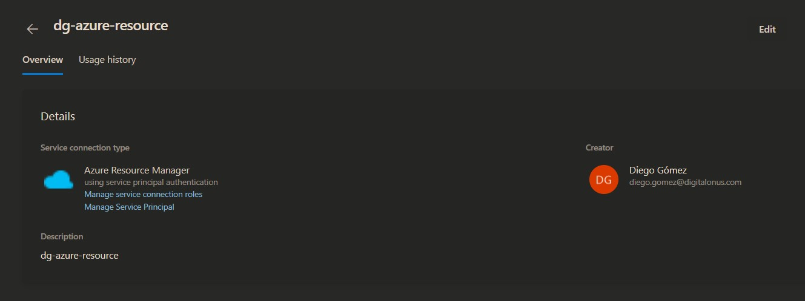
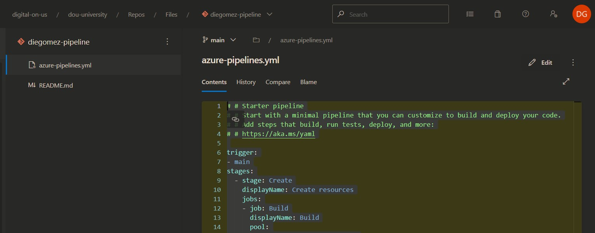
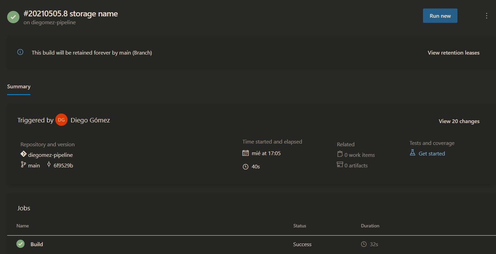

# 04 azure pipelines OPTIONAL

Create a pipeline that spins up the resources that you created in activity 03.

Your service connection created

Your repo in the browser, displaying the files that it has.

A successful pipeline run

The resources in your resource group, created by this pipeline
