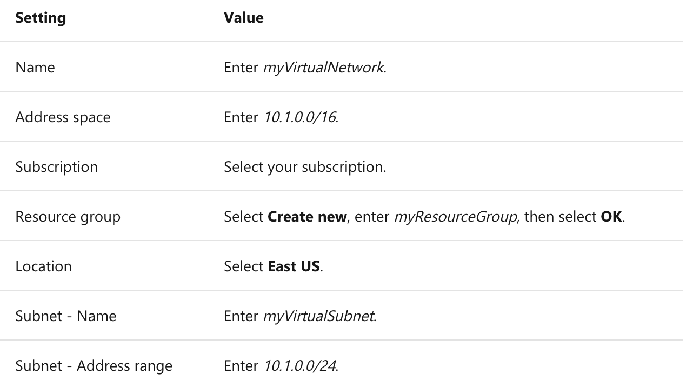
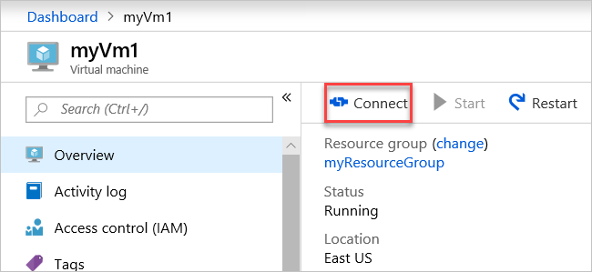

# Microsoft Azure
# 02 - Creating Azure Virtual Networks

### Instructions
- From the Azure portal menu, select **Create a resource**.
- From the Azure Marketplace, select **Networking > Virtual network**.
- In **Create virtual network**, enter or select this information:



- Leave the rest as default and select Create
- Create two VMs in the virtual network
- After you've created myVm1, connect to the internet. In the portal's search bar, enter myVm1 > Select the Connect button.



- Communicate between VMs
    - In the Remote Desktop of myVm2, open PowerShell.
    - Enter ping myVm1. You'll get back something like this message:

```
Pinging myVm1.0v0zze1s0uiedpvtxz5z0r0cxg.bx.internal.cloudapp.net [10.1.0.4] with 32 bytes of data:
Reply from 10.1.0.4: bytes=32 time=1ms TTL=128
Reply from 10.1.0.4: bytes=32 time<1ms TTL=128
Reply from 10.1.0.4: bytes=32 time<1ms TTL=128
Reply from 10.1.0.4: bytes=32 time<1ms TTL=128

Ping statistics for 10.1.0.4:
    Packets: Sent = 4, Received = 4, Lost = 0 (0% loss),
Approximate round trip times in milli-seconds:
    Minimum = 0ms, Maximum = 1ms, Average = 0ms
```

- Close the remote desktop connection to myVm2.


## Clean up resources

When you're done using the virtual network and the VMs, delete the resource group and all of the resources it contains:

Enter myResourceGroup in the **Search** box at the top of the portal and select **myResourceGroup** from the search results.

Select **Delete resource group**.

Enter myResourceGroup for **TYPE THE RESOURCE GROUP NAME** and select **Delete**.

### Expected deliverables
- MD file with each activity
- Documentation of procedures, include images if needed

### Evaluation

| Metric name        | Metric description                                | % Value |
|:------------------ |:--------------------------------------------------|:--:|
| MD format  | Clearity and completeness of their research | 40% |
| Virtual Network | Create a default virtual network and two VMs | 60% |
