# Chef

## Basic Chef Terminology

### An overview of Chef

Chef is a powerful automation platform that transforms infrastructure into code. Whether you’re operating in the cloud, on-premises, or in a hybrid environment, Chef automates how infrastructure is configured, deployed, and managed across your network, no matter its size.

This diagram shows how you develop, test, and deploy your Chef code.

- **Chef Workstation** is the location where users interact with Chef. With Chef Workstation, users can author and test cookbooks using tools such as Test Kitchen and interact with the Chef Server using the knife and chef command line tools.
- **Chef Client** nodes are the machines that are managed by Chef. The Chef Client is installed on each node and is used to configure the node to its desired state.
- **Chef Server** acts as a hub for configuration data. Chef Server stores cookbooks, the policies that are applied to nodes, and metadata that describes each registered node that is being managed by Chef. Nodes use the Chef Client to ask the Chef Server for configuration details, such as recipes, templates, and file distributions.

### Chef Components

The following diagram shows the relationships between the various elements of Chef, including the nodes, the server, and the workstation. These elements work together to provide the Chef Client the information and instruction that it needs so that it can do its job. As you are reviewing the rest of this topic, use the icons in the tables to refer back to this image.

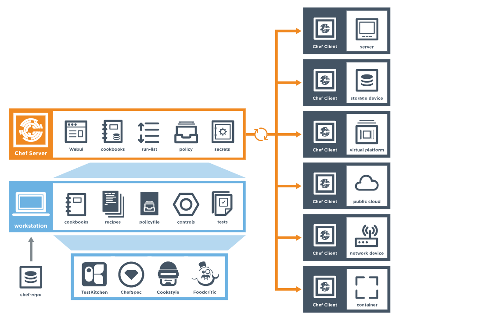

Chef has the following major components:

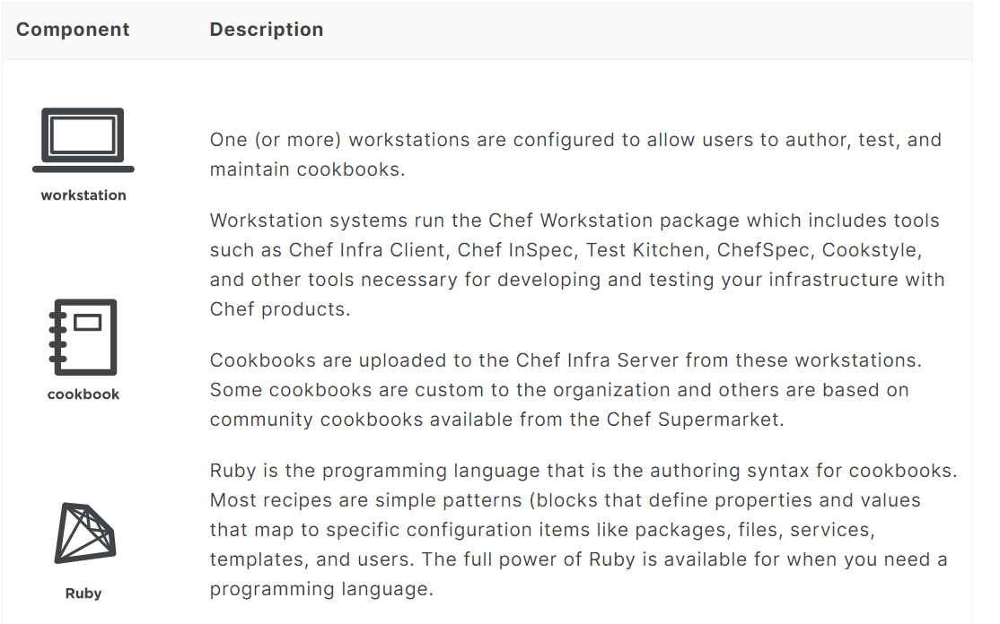
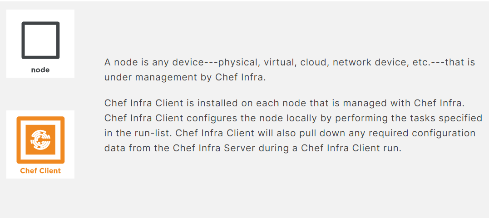
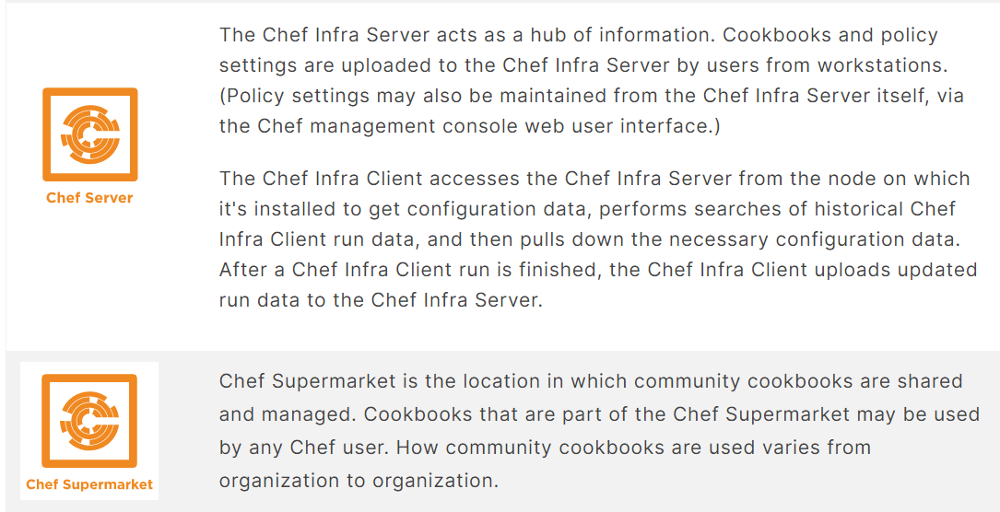

Chef Client run reporting, compliance reporting, high availability configurations, and Chef Server replication are available as part of Chef Automate.

The following sections discuss these elements (and their various components) in more detail.

### Workstations

A workstation is your local computer running Chef Workstation that you use to author cookbooks, interact with the Chef Server, and interact with nodes.

The workstation is where users do most of their work, including:

- Developing and testing cookbooks and recipes
- Testing Chef code
- Keeping the Chef repository synchronized with version source control
- Configuring organizational policy, including defining roles and environments, and ensuring that critical data is stored in data bags
- Interacting with nodes, as (or when) required, such as performing a bootstrap operation

### Chef Workstation components and tools

Some important tools and components of Chef Workstation include:

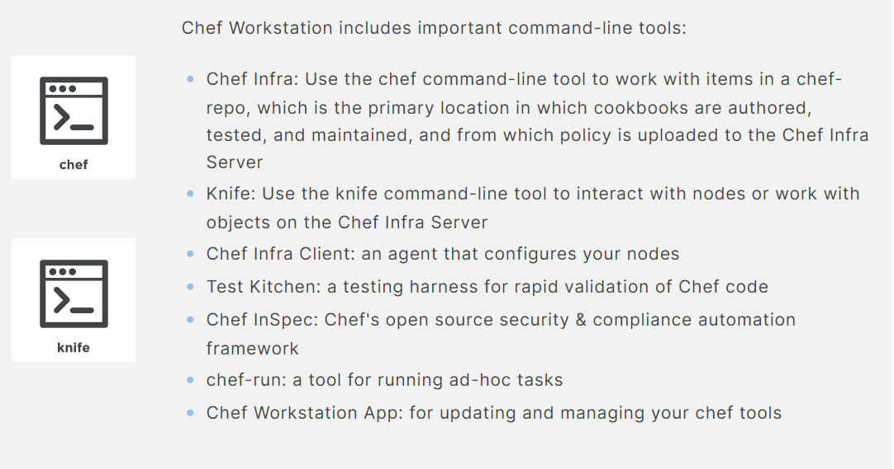

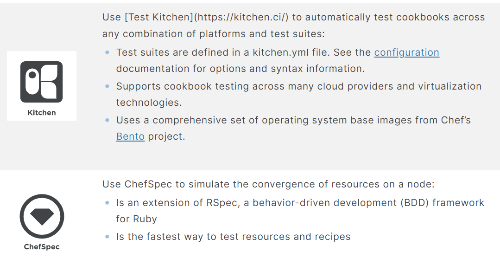

### Cookbooks

A cookbook is the fundamental unit of configuration and policy distribution. A cookbook defines a scenario and contains everything that is required to support that scenario:

- Recipes that specify the resources to use and the order in which they are to be applied
- Attribute values
- File distributions
- Templates
- Extensions to Chef, such as custom resources and libraries
- The Chef Client uses Ruby as its reference language for creating cookbooks and defining recipes, with an extended DSL for specific resources. A reasonable set of resources are available to the Chef Client, enough to support many of the most common infrastructure automation scenarios; however, this DSL can also be extended when additional resources and capabilities are required.

Components

Cookbooks are comprised of the following components:

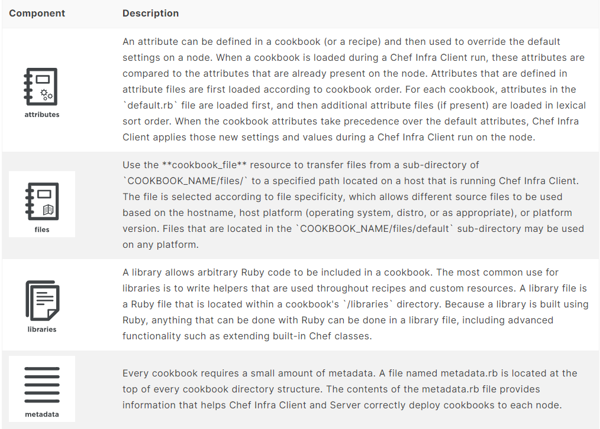
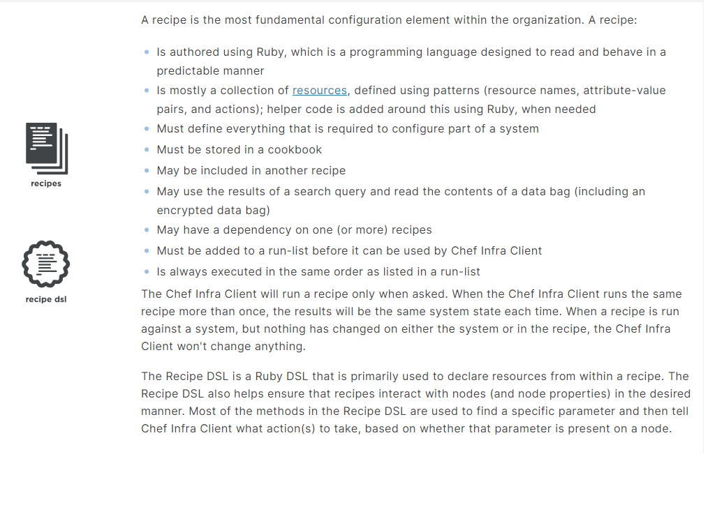
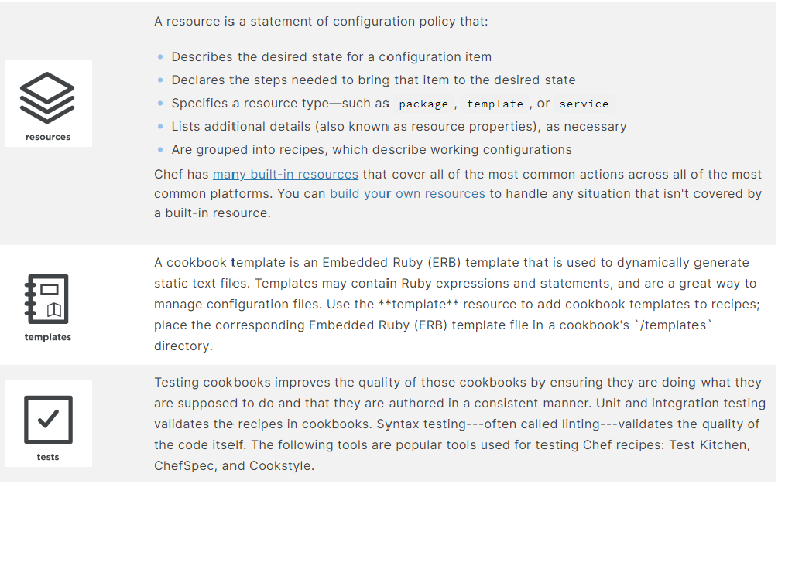

### Nodes

A node is any device - physical, virtual, cloud, network device, etc. - that is under management by Chef.

### Node Types

The types of nodes that can be managed by Chef include, but are not limited to, the following:

### Chef on Nodes

The key components of nodes that are under management by Chef include:

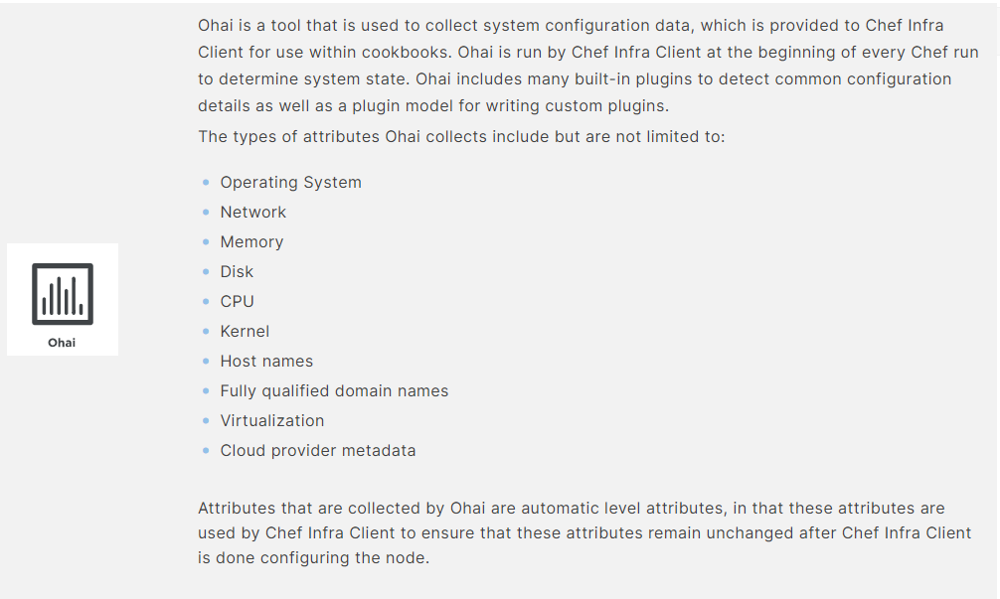

### The Chef Server

The Chef Server acts as a hub for configuration data. The Chef Server stores cookbooks, the policies that are applied to nodes, and metadata that describes each registered node that is being managed by Chef Client. Nodes use Chef Client to ask the Chef Server for configuration details, such as recipes, templates, and file distributions. Chef Client then does as much of the configuration work as possible on the nodes themselves (and not on the Chef Server). This scalable approach distributes the configuration effort throughout the organization.

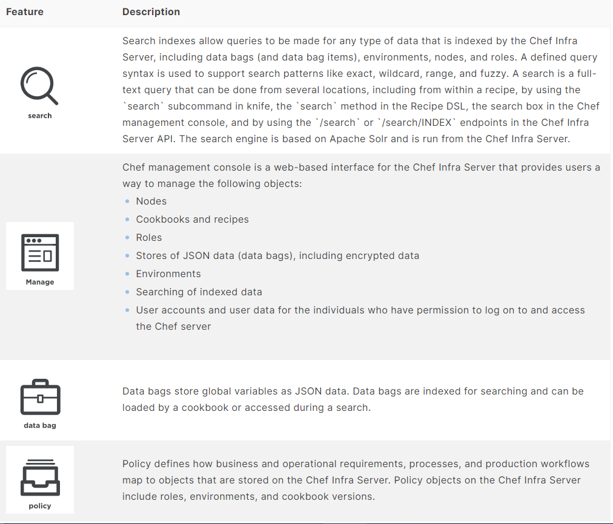

### Policy

Policy maps business and operational requirements, process, and workflow to settings and objects stored on the Chef Server:

- Roles define server types, such as “web server” or “database server”
- Environments define process, such as “dev”, “staging”, or “production”
- Certain types of data—passwords, user account data, and other sensitive items—can be placed in data bags, which are located in a secure sub-area on the Chef Server that can only be accessed by nodes that authenticate to the Chef Server with the correct SSL certificates
- The cookbooks (and cookbook versions) in which organization-specific configuration policies are maintained

Some important aspects of policy include:

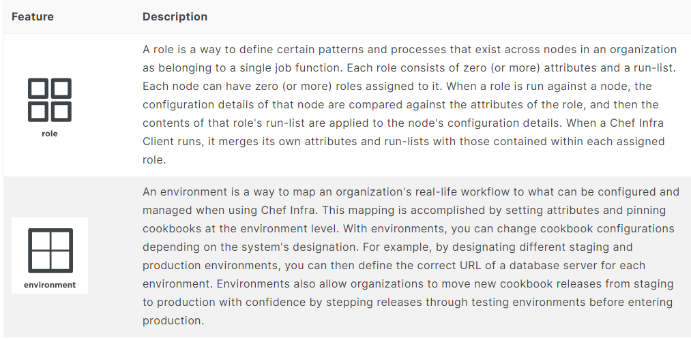
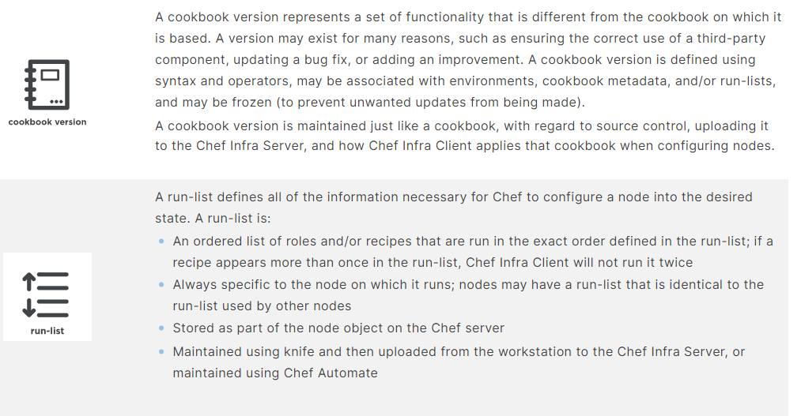

### Conclusion

Chef is a thin DSL (domain-specific language) built on top of Ruby. This approach allows Chef to provide just enough abstraction to make reasoning about your infrastructure easy. Chef includes a built-in taxonomy of all the basic resources one might configure on a system, plus a defined mechanism to extend that taxonomy using the full power of the Ruby language. Ruby was chosen because it provides the flexibility to use both the simple built-in taxonomy, as well as being able to handle any customization path your organization requires.

### Expected deliverables
- Develop a Presentation in group of 3 Grads and expose. 

### Evaluation

| Metric name | Description | % Value |
| ----------- |-------------| -------:|
| 01 - Understanding  | Clear Understanding of Each of the Chef Concepts | %25 |
| 02 - Architecture Idea   | Project and Code Structure / Designed | %25 |
| 03 - Collaboration   | Team Working and Integration | %25 |
| 04 - Functional   | It could be useful for an improvement | %25 |
