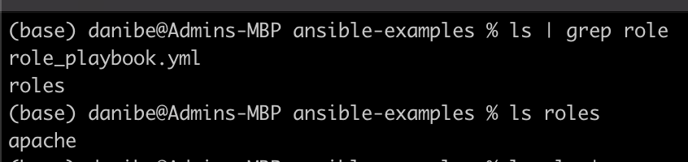
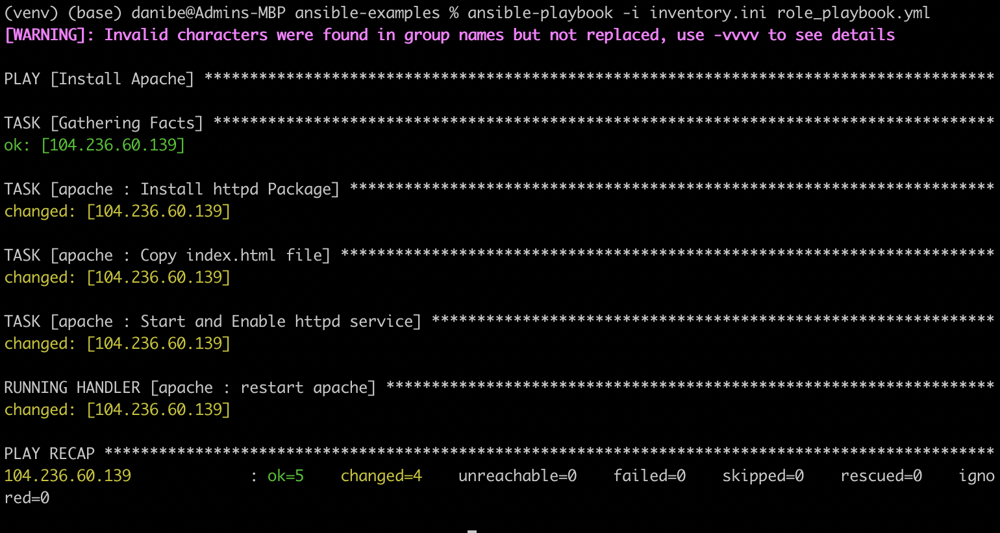
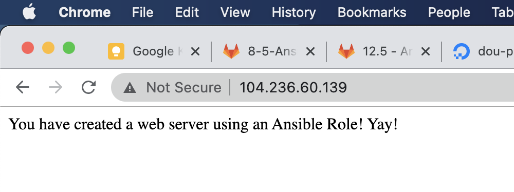

# Using ansible Roles

An ansible role, is a way to modularize ansible playbooks.

It is also a way to reuse ansible playbooks, and collaborate with the community.

More info [here](https://docs.ansible.com/ansible/latest/user_guide/playbooks_reuse_roles.html)

### Examples
This [github repo](https://github.com/ansible/ansible-examples) written by ansible has many playbook examples that use roles.

However, they are written for outdated CentOS versions. I tried to use the `wordpress with nginx` example and got some errors.

Still, they are useful so you can see examples of the file structure and use cases.

## Instructions

1. On your local computer run the following command to create the basic template of a role. (It will create a directory with the file structure of an ansible role)

> ansible-galaxy init apache --offline

2. Replace the `tasks/main.yml` file with the following:

        ---
        - name: Install httpd Package
        yum: name=httpd state=latest
        - name: Copy index.html file
        copy: src=files/index.html dest=/var/www/html
        notify:
        - restart apache
        - name: Start and Enable httpd service
        service: name=httpd state=restarted enabled=yes

3. Create a `index.html` file inside the `files/` directory with the following content or with something that you like to have a welcome message:

        You have created a web server using an Ansible Role! Yay!

4. Replace the `handlers/main.yml' file with the following: 

        ---
        - name: restart apache
        service: name=httpd state=restarted

5. Edit the `meta/main.yml' file to write your metadata

        author: 
        description: 
        company: 
    
6. Create a CentOS VM in the cloud provider of your choice.

Remember to allocate a public IP for the VM, and open the ports [22, 80].

Make sure that your public SSH key is authorized by the VM.

I chose to use Digital Ocean because the ports are open by default, and the public IP is also given by default.

7. Create an inventory file that includes the public IP of your newly created VM.

`inventory.ini`

        [digital-ocean]
        104.236.60.139  # replace this

8. Create a playbook file that will call the role

`role_playbook.yml` 

        --
        - name: Install Apache
        hosts: all
        remote_user: root

        roles:
            - apache

9. Organize your files

Where the `role_playbook.yml`, there should be a directory called `roles/`

Be sure to move the `apache` directory inside the `roles` directory

10. Run your playbook

> ansible-playbook -i inventory.ini role_playbook.yml

11. Visit your new website.

It should be the same IP as in the inventory.

## References

https://www.learnitguide.net/2018/02/ansible-roles-explained-with-examples.html

### Expected deliverables
- Playbook file with all of the necessary code.
- Inventory file
- Screenshot of the Play Recap
- Screenshot of the Homepage with the IP visible.
- Document all your steps to get to the result.
- Separate repo link of the Role created 

### Evaluation

| Metric name | Description | % Value |
| ----------- |-------------| -------:|
| Role creation  | Documentation of each step to create the apache role creation that proves it wasn't just copied over | 20% |
| Documentation | Screenshot of the play recap | 10% |
| Documentation | Screenshot of the homepage | 10% |
| Documentation | IP of the homepage matches the inventory file | 10% |
| Documentation | Screenshot of the deployed VM with public IP property visible | 10% |
| Files | Inventory file included | 15% |
| Files | Playbook file included | 15% |
| Files | Repo link of the role created | 10%|