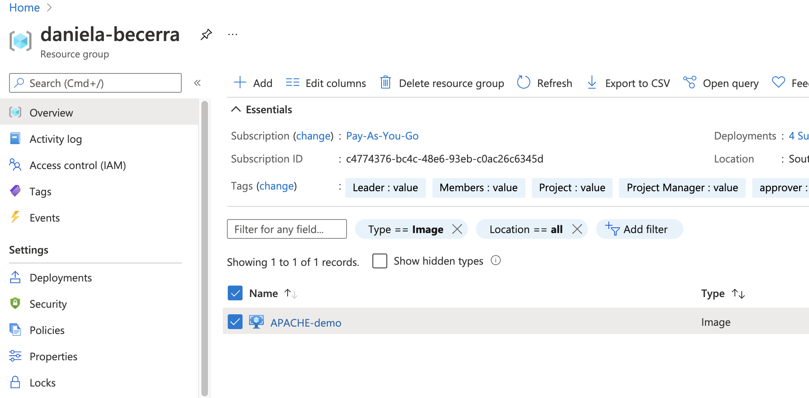

# Provision a Packer image

So far, you have learned you can provision hosts in an automated and scalable way.

If you could create a golden image that is already provisioned, you would be *shifting-left* the process, and doing less work for each host that you want to have for the same use. 

For example: Provision 1 image, deploy 100 VM's with the same image.

In this activity, you will provision a Centos image in Azure, with the same playbook of activity 4.

## Instructions

1. Install packer

2. Create a packer template file

`packer_template.json`

It is recommended that you stay with the same version of CentOS you used in the previous activity, this way, you know it will work.

        {
            "variables": {
                "az_client_secret": "{{env `ARM_CLIENT_SECRET`}}",
                "az_subscription_id": "{{env `ARM_SUBSCRIPTION_ID`}}",
                "az_client_id": "{{env `ARM_CLIENT_ID`}}",
                "az_tenant_id": "{{env `ARM_TENANT_ID`}}",
                "resourcegroup": "REPLACE THIS"
            },
            "builders": [
                {
                    "type": "azure-arm",

                    "client_id": "{{user `az_client_id`}}",
                    "client_secret": "{{user `az_client_secret`}}",
                    "tenant_id": "{{user `az_tenant_id`}}",
                    "subscription_id": "{{user `az_subscription_id`}}",

                    "os_type": "Linux",
                    "os_disk_size_gb": "65",
                    "disk_additional_size": "256",
                    "image_publisher": "OpenLogic",
                    "image_offer": "CentOS",
                    "image_sku": "7.7",
                    "managed_image_name": "APACHE-demo",
                    "managed_image_resource_group_name": "{{user `resourcegroup`}}",
                    "build_resource_group_name": "{{user `resourcegroup`}}",

                    "azure_tags": {
                        "ENV": "poc",
                        "application": "apache",
                        "team": "dou-university"
                    },

                    "vm_size": "Standard_E2_v3",
                    "custom_resource_build_prefix": "temporal",

                    "communicator": "ssh",
                    "ssh_timeout": "1m"
                }
            ],
            "provisioners": [
                {
                    "type": "ansible",
                    "playbook_file": "./packer_playbook.yml",
                    "use_proxy": false
                }
            ]
        }

3. Export the env variables you wrote on the packer template that correspond to an existing service principal. 

        export ARM_SUBSCRIPTION_ID=XXX
        export ARM_TENANT_ID=XXX
        export ARM_CLIENT_ID=XXX
        export ARM_CLIENT_SECRET=XXX  

If you don't already have an existing service principal, create one. (Refer to the Terraform module instructions for more info)

> az ad sp create-for-rbac -n "replace this" --role Contributor --scopes /subscriptions/$SUB_ID/resourceGroups/$RG_NAME

4. Edit some variables

* managed_image_name
* resourcegroup

5. Prepare your playbook file

You can make a copy of the playbook used in activity 4, and replace some values to make it look like this:

        ---
        - name: Install Apache
        hosts: all
        remote_user: azureuser
        become: yes

        roles:
            - apache

Make sure the playbook name matches the variable in the template called `playbook_file`
 

6. Build the packer image

> packer build packer_template.json

You will see some output like this.

Above, we can see the play recap inside the packer build process.

It takes about 6 minutes.

The output confirms the name of the image created: APACHE-demo (this can be different for you)

7. Go to the portal and make sure the image is in your resource group now.

8. Create a new VM using the portal.

When choosing the image, click on `see all images`
 

Under "My items", choose `my images`. You should see the image you created there.

9. Setup the VM

Make sure to:

- Assign the VM a public IP
- Open ports 22 & 80

10. Capture the IP assigned

In my case it was 40.124.48.232

11. Navigate to your homepage

12. Extra points (50 extra points in any activity of the Azure, Terraform or Ansible modules)

Setup the VM & IP with terraform.

Hints:

* Use a data source for the image with the name you used and the resource group it's in.

        data "azurerm_image" "my-demo-image" {
            name = "APACHE-demo"
            resource_group_name = data.azurerm_resource_group.daniela-rg.name
        }

        data "azurerm_resource_group" "daniela-rg" {
            name = "daniela-becerra"
        }

* Use the `azurerm_virtual_machine` resource and in the `storage_image_reference` block, use the image data id.

        resource "azurerm_virtual_machine" "demo-vm" {
            name = ""
            location = ""
            resource_group_name = 
            vm_size = 
            network_interface_ids = 
            delete_os_disk_on_termination = true 
            delete_data_disks_on_termination = true 
            
            # MORE BLOCKS WERE OMMITED JUST TO DEMO THE STORAGE IMAGE REFERENCE
        
            storage_image_reference {
                id = data.azurerm_image.my-demo-image.id
            }

        }

## References

- [Microsoft documentation to create a linux packer image](https://docs.microsoft.com/en-us/azure/virtual-machines/linux/build-image-with-packer)

- [How to know builder specific options](https://www.packer.io/docs/builders/azure/arm)

- [Install Packer](https://learn.hashicorp.com/tutorials/packer/get-started-install-cli)

### Expected deliverables
- Playbook file with all of the necessary code.
- Packer template file
- Screenshot of the Play Recap in the packer build output
- Screenshot of the image created in the azure portal
- Screnshot of the VM creation process and choosing the image
- Screenshot of the public IP of the VM
- Screenshot of the homepage with IP visible and matching to the VM's IP
- Terraform files (if applicable)
- Document all your steps to get to the result.

### Evaluation

| Metric name | Description | % Value |
| ----------- |-------------| -------:|
| Role creation  | Documentation of each step to create the image and the VM | 20% |
| Documentation | Screenshot of the play recap inside packer build output | 10% |
| Documentation | Screenshot of the image created in the azure portal | 10%| 
| Documentation | Screnshot of the VM creation process and choosing the image | 10%|
| Documentation | Screenshot of the homepage | 10% |
| Documentation | Screenshot of the homepage that matches the VM's IP | 10% |
| Documentation | Screenshot of the deployed VM with public IP property visible | 10% |
| Files | Packer template file | 10% |
| Files | Playbook file included | 10% |
