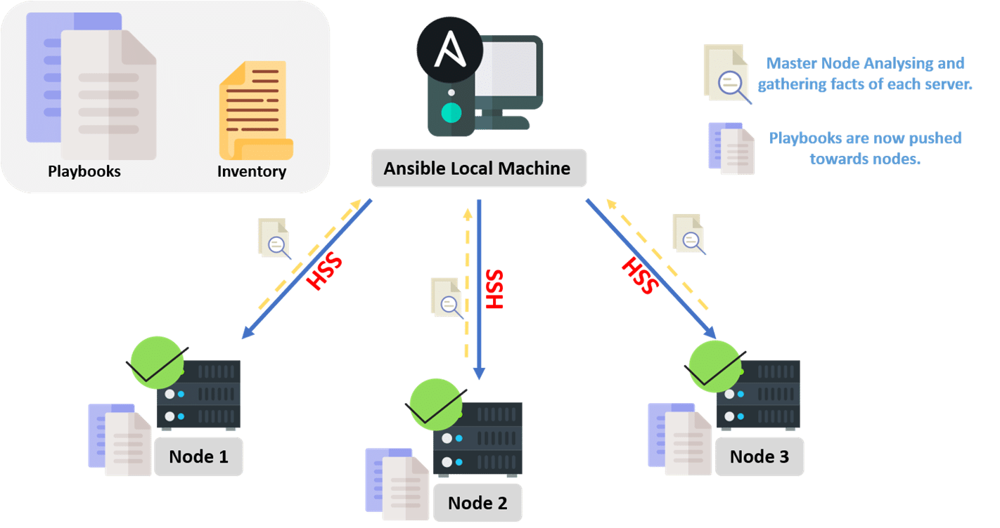

# Ansible: basic concepts

## What is Ansible?

Ansible is a tool, python based, used for server management and IT automation. We can highlight some of the most important points for this tool:

 - Server Provisioning. Install any package for the most used distributions, like Redhat/Debian based.
 - Application deployment.
 - Accomplish any IT task with "Plays" and "Playbooks" in a consistent way, using orchestration and idempotency.

# The diagram

Ansible doesn't need any configuration that must follow a master node. **Any node in our infrastructure can acts as master**. Below is the representation of how Ansible handle each node to get the final state previously defined:

As you can validate, the following steps are created any time that you run a playbook:

 - Ansible client reach your playbook and before launch, do a quick validation of the syntax used to determinate if is correct.

  - Once the first validation was succeed, inventory is reached and continues with the second round of validations, trying to reach any node declared in the inventory.

  - Finally, when all nodes were validated, instructions declared in our playbooks are send to all nodes, waiting for it's execution one by one.

