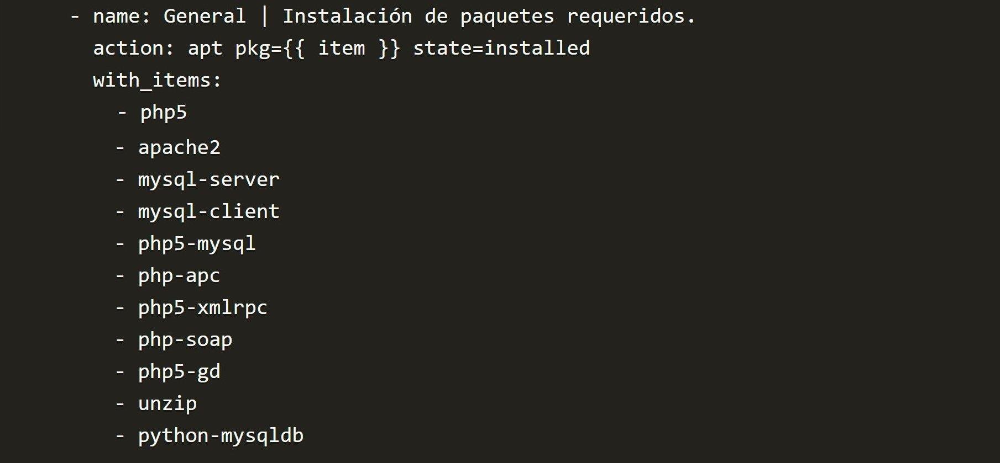
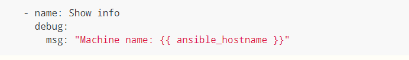
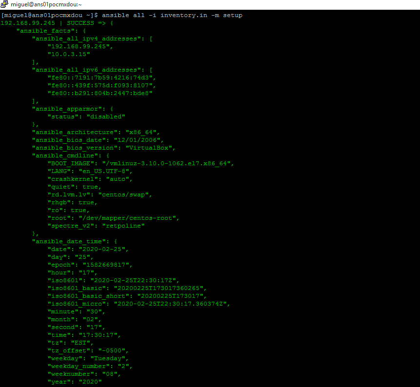

# Theory implied under playbooks

## Inventory

Inventory can be one or more files where we placed our servers or Ip's to work with Ansible.
Inventory is needed when you work with the commands **ansible-playbook** and **ansible adhoc** modes. The following is one example of hostnames placed into the inventory:

```sh
##Ansible inventory
[webservers]
foo.example.com
bar.example.com
[dbservers]
one.example.com
two.example.com
three.example.com
```

### Limit the inventory

Ansible has different options to limit the playbook or ansible adhoc command execution only for a few nodes:

**Recommended option:**
```sh
###Limit into playbook. e.g.
- name: restart webservers
  hosts: webservers
```

**While this option works, this is not recommend to use:**

```sh
### Inside your terminal command:
 --limit “groupname”
```

## Adhoc commands

Ansible allow to run any available module into one-line under terminal. They are quick and easy to use, but are not reusable. 
Adhoc are great for those tasks that you need to complete rarely. Let's say that you reboot your nodes because you want to perform a quick validation. Ansible adhoc allow to do this without writting a playbook.

The following syntax is valid (and is the recommended):
```sh
$ ansible [pattern] -m [module] -a "[module options]"
```

## Ansible playbooks

Playbooks are the language by which Ansible orchestrates,
configures, administers, or deploys systems. They are called
playbooks partially because it’s a sports analogy, and it’s supposed
to be fun using them. They aren’t workbooks :)

Same ideology as puppet.

Files are created with **.yml** extension. Is important to note that every play has identation inside every instruction:

```sh
vars_prompt:
- name: "INC"
    prompt: "INC # "
    private: no
```

Very similar from how Python works ;)

### Looking inside playbooks

The following code is a valid example of how should like a functional playbook:
```sh
## Below lines (3 hypens ---) indicate that the code below is a Playbook! Never forget to use it!!
---
- hosts: all
remote_user: whatever_you_want
become: yes

vars_prompt:
- name: "INC"
    prompt: "INC # "
    private: no

tasks:
- name: Get timestamp from server.
shell: "date +%d%m%Y"
register: time_lnx
```

## Tasks

Task are executed **in order, one by one**. If some of the nodes are
not reachable , it will be rejected from the list and the execution
won't stop.

Every task should have a name, that must be DESCRIPTIVE
according to the main job.

What happen if some task are not logical correct or fails? Let ́s
check in a live example:

```sh
[miguel@ans01pocmxdou ~]$ cat logic_playbook.yml 
---
- hosts: all
  become: yes
      
  tasks:

  - name: Install apache web server with latest version.
    systemd:
      name: OswAtcher
      state: started

  - name: Install last version of PHP.
    yum:
      name: php
      state: installed
```

From above code, we can identify the following logic errors:

* We have a  task that says that Apache web server will be installed, but module **systemd** is called.
* name instruction calls **"OswAtcher"**. Remember that GNU/Linux systems are case sensitive. Is rare to find binary mixed with that nomenclature.

Since the first task has 2 logic errors, ansible won't continue with the execution:

```sh
[miguel@ans01pocmxdou ~]$ ansible-playbook -i inventory.in logic_playbook.yml -K
SUDO password: 

PLAY [all] *************************************************************************************************************************************************************************************************

TASK [Gathering Facts] *************************************************************************************************************************************************************************************
ok: [192.168.1.74]
ok: [192.168.1.75]

TASK [Install apache web server with latest version.] ******************************************************************************************************************************************************
fatal: [192.168.1.74]: FAILED! => {"changed": false, "msg": "Could not find the requested service OswAtcher: host"}
fatal: [192.168.1.75]: FAILED! => {"changed": false, "msg": "Could not find the requested service OswAtcher: host"}
	to retry, use: --limit @/home/miguel/logic_playbook.retry

PLAY RECAP *************************************************************************************************************************************************************************************************
192.168.1.74               : ok=1    changed=0    unreachable=0    failed=1   
192.168.1.75               : ok=1    changed=0    unreachable=0    failed=1 
```
As you can see, the second task was not executed. That's why we need  to pay extra attention to validate our logic used.

Ansible is powerful, but he need our help to type the correct syntax and logic to complete any task in our infra.

## Tasks: use of notify.

notify is an special instruction under some tasks. They will be
executed **only one time**, doesn ́t matter if notify is called 10 or
1000 times.

These ‘notify’ actions are triggered at the end of each block of tasks in a play, and will only be triggered once even if notified by multiple different tasks.

For instance, multiple resources may indicate that apache needs to be restarted because they have changed a config file, but apache will only be bounced once to avoid unnecessary restarts.

Here’s an example of restarting two services when the contents of a file change, but only if the file changes:

```sh
- name: template configuration file
  template:
    src: template.j2
    dest: /etc/foo.conf
  notify:
     - restart memcached
     - restart apache
```

## Handlers
Handlers are lists of tasks, not really any different from regular tasks, that are referenced by a globally unique name, and are notified by notifiers. If nothing notifies a handler, it will not run. Regardless of how many tasks notify a handler, it will run only once, after all of the tasks complete in a particular play.

Here’s an example handlers section:

```sh
handlers:
    - name: restart memcached
      service:
        name: memcached
        state: restarted
    - name: restart apache
      service:
        name: apache
        state: restarted
```

## Tasks: with_items / item
Some times, we will need install a list of packages, or do some
action over a list of elements. Item is the worker that can help us
accomplishing those tasks:



## Variables
Variables as any other language, stores information that we can
use after in the execution of the playbook. We can declare them as follows:

 - Inside the playbook
 - J2 files (templates)

```sh
- hosts: webservers
  vars:
    http_port: 80
```
## Ansible facts
Facts are used to apply commands to specific hosts. Return a Python
dictionary with the information **reported by every host in our inventory**.

Result of getting facts, can be used as variables to apply certain tasks to our servers.




### Useful cases:

In a play where I need to get the following information:

- Get the dmidecode information only from physical nodes.
- Install spacewalk client only on virtualmachines.

### Example

My boss is asking to install PHP in Debian family and Apache web server in Redhat family servers. My local inventory are not sectioned, so, I don't know how to proceed with above requeriment:

```sh
cat inventory.in
[All-infra]
192.168.40.61
192.168.40.62
192.168.40.63
192.168.40.64
192.168.40.65
192.168.40.66
192.168.40.67
192.168.40.68
192.168.40.69
192.168.40.70
192.168.40.71
192.168.40.72
192.168.40.73
192.168.40.74
192.168.40.75
192.168.40.76
192.168.40.77
192.168.40.78
192.168.40.79
192.168.40.80
```
Proposed ansible-playbook:
```sh
---
- hosts: All-infra
  become: yes ## Since I need to perform root tasks, become is necessary
      
  tasks:

  - name: Install apache web server with latest version for Redhat servers.
    yum:
      name: httpd 
      state: installed
      when: (ansible_facts['os_family'] == "Redhat")

    apt:
      name: php
      state: installed
      when: (ansible_facts['os_family'] == "Debian")
```
Above solution works as expected :)

How we can get all of the ansible_facts values?

```sh
ansible all -m setup -i inventory.in
```

