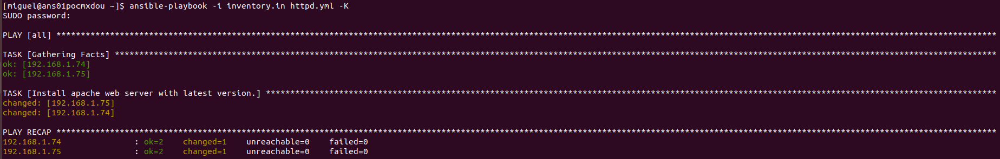
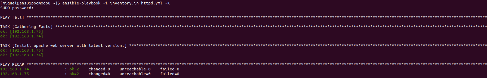

# Ansible
## Orchestration

**For ansible**, orchestration is the handler for an orchestra.

Datacenters playing many parts; web, db, load b., monitoring
servers all of them need to be touched in particular order.
Some systems may perform some steps, then others. 

Other systems may processed other steps. Ansible orchestration tries to
model that system steps.

## Idempotency

We can say that operation is idempotent if the result of performing once is exactly the same as the result of performing it repeatedly without any intervening actions.
Being more specific, we are looking that Ansible install Apache package in our QA servers:

```sh
- name: Install apache web server package in last version.
  yum:
    name: httpd
    state: latest
```

Ansible will run on all hosts specified in our inventory for the first time.

What happen if I run again exactly the same operation?

Lets try with a visual example:

 - First run:
   

  - Second run:
    

As you can see, we have defined a **final state** for our servers. Our objetive is have the latest version of Apache webserver. Since Ansible have detected that Apache is installed in the second run, the final state is what we are looking for, hence, no changes.
