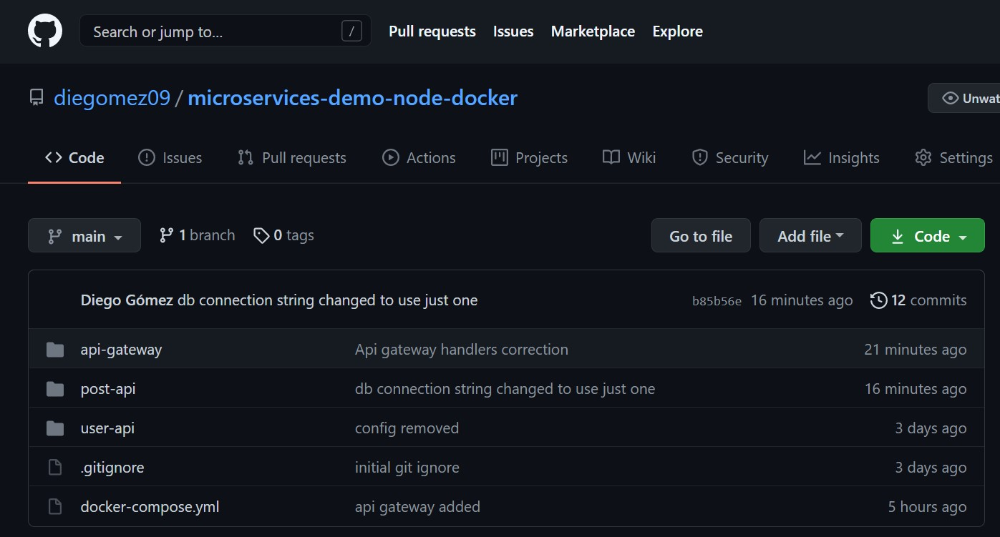

# Microservices
The requierements of this activity was to be able to deploy or design a monolithic application to a micro services application.
You can find the micro services updated application [HERE](https://github.com/diegomez09/microservices-demo-node-docker)

```
docker-compose build
docker-compose up
```