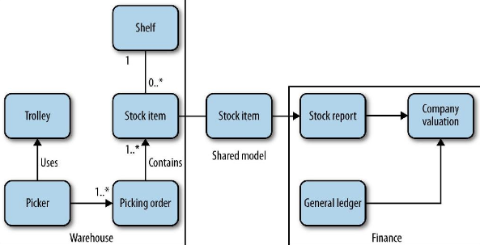

# How to Model Services

So you know what microservices are, and hopefully have a sense of their key benefits. You’re probably eager now to go and start making them, right? But where to start? We’ll look at how to think about the boundaries of your microservices that will hopefully maximize the upsides and avoid some of the potential downsides. But first, we need something to work with.

## Introducing MusicCorp

So let’s turn our attention to the cutting-edge online retailer MusicCorp. MusicCorp was recently a brick-and-mortar retailer, but after the bottom dropped out of the gramophone record business it focused more and more of its efforts online. The company has a website, but feels that now is the time to double-down on the online world. After all, those iPods are just a passing fad (Zunes are way better, obviously) and music fans are quite happy to wait for CDs to arrive at their doorsteps. Quality over convenience, right? And while we’re at it, what’s this Spotify thing people keep talking about — some sort of skin treatment for teenagers?

Despite being a little behind the curve, MusicCorp has grand ambitions. Luckily, it has decided that its best chance of taking over the world is by making sure it can make changes as easily as possible. Microservices for the win!

Before the team from MusicCorp tears off into the distance, creating service after service in an attempt to deliver eight-track tapes to all and sundry, let’s put the brakes on and talk a bit about the most important underlying idea we need to keep in mind. What makes a good service? If you’ve survived a failed SOA implementation, you may have some idea where I’m going next. But just in case you aren’t that (un)fortunate, I want you to focus on two key concepts: loose coupling and high cohesion.

### Loose Coupling

When services are loosely coupled, a change to one service should not require a change to another. The whole point of a microservice is being able to make a change to one service and deploy it, without needing to change any other part of the system. This is really quite important.

What sort of things cause tight coupling? A classic mistake is to pick an integration style that tightly binds one service to another, causing changes inside the service to require a change to consumers.

A loosely coupled service knows as little as it needs to about the services with which it collaborates. This also means we probably want to limit the number of different types of calls from one service to another, because beyond the potential performance problem, chatty communication can lead to tight coupling.

### High Cohesion

We want related behavior to sit together, and unrelated behavior to sit elsewhere. Why? Well, if we want to change behavior, we want to be able to change it in one place, and release that change as soon as possible. If we have to change that behavior in lots of different places, we’ll have to release lots of different services (perhaps at the same time) to deliver that change. Making changes in lots of different places is slower, and deploying lots of services at once is risky — both of which we want to avoid.

So we want to find boundaries within our problem domain that help ensure that related behavior is in one place, and that communicate with other boundaries as loosely as possible.

## The Bounded Context

Eric Evans’s book Domain-Driven Design (Addison-Wesley) focuses on how to create systems that model real-world domains. The book is full of great ideas like using ubiquitous language, repository abstractions, and the like, but there is one very important concept Evans introduces that completely passed me by at first: bounded context. The idea is that any given domain consists of multiple bounded contexts, and residing within each are things (Eric uses the word model a lot, which is probably better than things) that do not need to be communicated outside as well as things that are shared externally with other bounded contexts. Each bounded context has an explicit interface, where it decides what models to share with other contexts.

Another definition of bounded contexts I like is “a specific responsibility enforced by explicit boundaries.”1 If you want information from a bounded context, or want to make requests of functionality within a bounded context, you communicate with its explicit boundary using models. In his book, Evans uses the analogy of cells, where “[c]ells can exist because their membranes define what is in and out and determine what can pass.”

Let’s return for a moment to the MusicCorp business. Our domain is the whole business in which we are operating. It covers everything from the warehouse to the reception desk, from finance to ordering. We may or may not model all of that in our software, but that is nonetheless the domain in which we are operating. Let’s think about parts of that domain that look like the bounded contexts that Evans refers to. At MusicCorp, our warehouse is a hive of activity — managing orders being shipped out (and the odd return), taking delivery of new stock, having forklift truck races, and so on. Elsewhere, the finance department is perhaps less fun-loving, but still has a very important function inside our organization. These employees manage payroll, keep the company accounts, and produce important reports. Lots of reports. They probably also have interesting desk toys.

## Shared and Hidden Models

For MusicCorp, we can then consider the finance department and the warehouse to be two separate bounded contexts. They both have an explicit interface to the outside world (in terms of inventory reports, pay slips, etc.), and they have details that only they need to know about (forklift trucks, calculators).

Now the finance department doesn’t need to know about the detailed inner workings of the warehouse. It does need to know some things, though — for example it needs to know about stock levels to keep the accounts up to date.

This image shows an example context diagram. We see concepts that are internal to the warehouse, like Picker (people who pick orders), shelves that represent stock locations, and so on. Likewise, the company’s general ledger is integral to finance but is not shared externally here.

To be able to work out the valuation of the company, though, the finance employees need information about the stock we hold. The stock item then becomes a shared model between the two contexts. However, note that we don’t need to blindly expose everything about the stock item from the warehouse context. For example, although internally we keep a record on a stock item as to where it should live within the warehouse, that doesn’t need to be exposed in the shared model. So there is the internal-only representation, and the external representation we expose.

Sometimes we may encounter models with the same name that have very different meanings in different contexts too. For example, we might have the concept of a return, which represents a customer sending something back. Within the context of the customer, a return is all about printing a shipping label, dispatching a package, and waiting for a refund. For the warehouse, this could represent a package that is about to arrive, and a stock item that needs to be restocked. It follows that within the warehouse we store additional information associated with the return that relates to the tasks to be carried out; for example, we may generate a restock request. The shared model of the return becomes associated with different processes and supporting entities within each bounded context, but that is very much an internal concern within the context itself.

## Modules and Services

By thinking clearly about what models should be shared, and not sharing our internal representations, we avoid one of the potential pitfalls that can result in tight coupling (the opposite of what we want). We have also identified a boundary within our domain where all like-minded business capabilities should live, giving us the high cohesion we want. These bounded contexts, then, lend themselves extremely well to being compositional boundaries.

We have the option of using modules within a process boundary to keep related code together and attempt to reduce the coupling to other modules in the system. When you’re starting out on a new codebase, this is probably a good place to begin. So once you have found your bounded contexts in your domain, make sure they are modeled within your codebase as modules, with shared and hidden models.

These modular boundaries then become excellent candidates for microservices. In general, microservices should cleanly align to bounded contexts. Once you become very proficient, you may decide to skip the step of keeping the bounded context modeled as a module within a more monolithic system, and jump straight for a separate service. When starting out, however, keep a new system on the more monolithic side; getting service boundaries wrong can be costly, so waiting for things to stabilize as you get to grips with a new domain is sensible.

So, if our service boundaries align to the bounded contexts in our domain, and our microservices represent those bounded contexts, we are off to an excellent start in ensuring that our microservices are loosely coupled and strongly cohesive.

## Business Capabilities

When you start to think about the bounded contexts that exist in your organization, you should be thinking not in terms of data that is shared, but about the capabilities those contexts provide the rest of the domain. The warehouse may provide the capability to get a current stock list, for example, or the finance context may well expose the end-of-month accounts or let you set up payroll for a new recruit. These capabilities may require the interchange of information — shared models — but I have seen too often that thinking about data leads to anemic, CRUD-based (create, read, update, delete) services. So ask first “What does this context do?”, and then “So what data does it need to do that?”

When modeled as services, these capabilities become the key operations that will be exposed over the wire to other collaborators.

## Summary

Bounded contexts are a vital tool in helping us find these seams, and by aligning our microservices to these boundaries we ensure that the resulting system has every chance of keeping those virtues intact. We’ve also got a hint about how we can subdivide our microservices further.

The ideas presented in Eric Evans’s Domain-Driven Design are very useful to us in finding sensible boundaries for our services, and I’ve just scratched the surface here. I recommend Vaughn Vernon’s book Implementing Domain-Driven Design (Addison-Wesley) to help you understand the practicalities of this approach.
