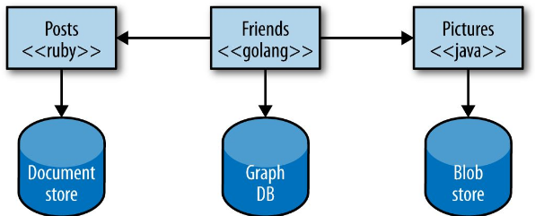
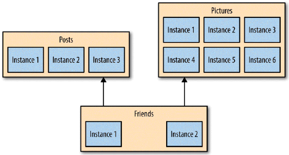

# Microservices

For many years now, we have been finding better ways to build systems. We have been learning from what has come before, adopting new technologies, and observing how a new wave of technology companies operate in different ways to create IT systems that help make both their customers and their own developers happier.

Eric Evans’s book Domain-Driven Design (Addison-Wesley) helped us understand the importance of representing the real world in our code, and showed us better ways to model our systems. The concept of continuous delivery showed how we can more effectively and efficiently get our software into production, instilling in us the idea that we should treat every check-in as a release candidate. Our understanding of how the Web works has led us to develop better ways of having machines talk to other machines. Alistair Cockburn’s concept of [hexagonal architecture](https://bit.ly/38UVVEN) guided us away from layered architectures where business logic could hide. Virtualization platforms allowed us to provision and resize our machines at will, with infrastructure automation giving us a way to handle these machines at scale. Some large, successful organizations like Amazon and Google espoused the view of small teams owning the full lifecycle of their services. And, more recently, Netflix has shared with us ways of building antifragile systems at a scale that would have been hard to comprehend just 10 years ago.

Domain-driven design. Continuous delivery. On-demand virtualization. Infrastructure automation. Small autonomous teams. Systems at scale. Microservices have emerged from this world. They weren’t invented or described before the fact; they emerged as a trend, or a pattern, from real-world use. But they exist only because of all that has gone before. Throughout this course, I will pull strands out of this prior work to help paint a picture of how to build, manage, and evolve microservices.

Many organizations have found that by embracing fine-grained, microservice architectures, they can deliver software faster and embrace newer technologies. Microservices give us significantly more freedom to react and make different decisions, allowing us to respond faster to the inevitable change that impacts all of us.

## What are Microservices?

Microservices are small, autonomous services that work together. Let’s break that definition down a bit and consider the characteristics that make microservices different.

## Benefits

### Technology Heterogeneity

With a system composed of multiple, collaborating services, we can decide to use different technologies inside each one. This allows us to pick the right tool for each job, rather than having to select a more standardized, one-size-fits-all approach that often ends up being the lowest common denominator.

If one part of our system needs to improve its performance, we might decide to use a different technology stack that is better able to achieve the performance levels required. We may also decide that how we store our data needs to change for different parts of our system. For example, for a social network, we might store our users’ interactions in a graph-oriented database to reflect the highly interconnected nature of a social graph, but perhaps the posts the users make could be stored in a document-oriented data store, giving rise to a heterogeneous architecture like the one shown here

With microservices, we are also able to adopt technology more quickly, and understand how new advancements may help us. One of the biggest barriers to trying out and adopting new technology is the risks associated with it. With a monolithic application, if I want to try a new programming language, database, or framework, any change will impact a large amount of my system. With a system consisting of multiple services, I have multiple new places in which to try out a new piece of technology. I can pick a service that is perhaps lowest risk and use the technology there, knowing that I can limit any potential negative impact. Many organizations find this ability to more quickly absorb new technologies to be a real advantage for them.

Embracing multiple technologies doesn’t come without an overhead, of course. Some organizations choose to place some constraints on language choices. Netflix and Twitter, for example, mostly use the Java Virtual Machine (JVM) as a platform, as they have a very good understanding of the reliability and performance of that system. They also develop libraries and tooling for the JVM that make operating at scale much easier, but make it more difficult for non-Java-based services or clients. But neither Twitter nor Netflix use only one technology stack for all jobs, either. Another counterpoint to concerns about mixing in different technologies is the size. If I really can rewrite my microservice in two weeks, you may well mitigate the risks of embracing new technology.

### Resilience

A key concept in resilience engineering is the bulkhead. If one component of a system fails, but that failure doesn’t cascade, you can isolate the problem and the rest of the system can carry on working. Service boundaries become your obvious bulkheads. In a monolithic service, if the service fails, everything stops working. With a monolithic system, we can run on multiple machines to reduce our chance of failure, but with microservices, we can build systems that handle the total failure of services and degrade functionality accordingly.

We do need to be careful, however. To ensure our microservice systems can properly embrace this improved resilience, we need to understand the new sources of failure that distributed systems have to deal with. Networks can and will fail, as will machines. We need to know how to handle this, and what impact (if any) it should have on the end user of our software.

### Scaling

With a large, monolithic service, we have to scale everything together. One small part of our overall system is constrained in performance, but if that behavior is locked up in a giant monolithic application, we have to handle scaling everything as a piece. With smaller services, we can just scale those services that need scaling, allowing us to run other parts of the system on smaller, less powerful hardware, like here...

Gilt, an online fashion retailer, adopted microservices for this exact reason. Starting in 2007 with a monolithic Rails application, by 2009 Gilt’s system was unable to cope with the load being placed on it. By splitting out core parts of its system, Gilt was better able to deal with its traffic spikes, and today has over 450 microservices, each one running on multiple separate machines.

When embracing on-demand provisioning systems like those provided by Amazon Web Services, we can even apply this scaling on demand for those pieces that need it. This allows us to control our costs more effectively. It’s not often that an architectural approach can be so closely correlated to an almost immediate cost savings.

### Ease of Deployment

A one-line change to a million-line-long monolithic application requires the whole application to be deployed in order to release the change. That could be a large-impact, high-risk deployment. In practice, large-impact, high-risk deployments end up happening infrequently due to understandable fear. Unfortunately, this means that our changes build up and build up between releases, until the new version of our application hitting production has masses of changes. And the bigger the delta between releases, the higher the risk that we’ll get something wrong!

With microservices, we can make a change to a single service and deploy it independently of the rest of the system. This allows us to get our code deployed faster. If a problem does occur, it can be isolated quickly to an individual service, making fast rollback easy to achieve. It also means we can get our new functionality out to customers faster. This is one of the main reasons why organizations like Amazon and Netflix use these architectures — to ensure they remove as many impediments as possible to getting software out the door.

### Organizational Alignment

Many of us have experienced the problems associated with large teams and large codebases. These problems can be exacerbated when the team is distributed. We also know that smaller teams working on smaller codebases tend to be more productive.

Microservices allow us to better align our architecture to our organization, helping us minimize the number of people working on any one codebase to hit the sweet spot of team size and productivity. We can also shift ownership of services between teams to try to keep people working on one service colocated.

### Composability

One of the key promises of distributed systems and service-oriented architectures is that we open up opportunities for reuse of functionality. With microservices, we allow for our functionality to be consumed in different ways for different purposes. This can be especially important when we think about how our consumers use our software. Gone is the time when we could think narrowly about either our desktop website or mobile application. Now we need to think of the myriad ways that we might want to weave together capabilities for the Web, native application, mobile web, tablet app, or wearable device. As organizations move away from thinking in terms of narrow channels to more holistic concepts of customer engagement, we need architectures that can keep up.

With microservices, think of us opening up seams in our system that are addressable by outside parties. As circumstances change, we can build things in different ways. With a monolithic application, I often have one coarse-grained seam that can be used from the outside. If I want to break that up to get something more useful, I’ll need a hammer! In this course, We’ll discuss ways for you to break apart existing monolithic systems, and hopefully change them into some reusable, re-composable microservices.

### Optimizing for Replaceability

f you work at a medium-size or bigger organization, chances are you are aware of some big, nasty legacy system sitting in the corner. The one no one wants to touch. The one that is vital to how your company runs, but that happens to be written in some odd Fortran variant and runs only on hardware that reached end of life 25 years ago. Why hasn’t it been replaced? You know why: it’s too big and risky a job.

With our individual services being small in size, the cost to replace them with a better implementation, or even delete them altogether, is much easier to manage. How often have you deleted more than a hundred lines of code in a single day and not worried too much about it? With microservices often being of similar size, the barriers to rewriting or removing services entirely are very low.

Teams using microservice approaches are comfortable with completely rewriting services when required, and just killing a service when it is no longer needed. When a codebase is just a few hundred lines long, it is difficult for people to become emotionally attached to it, and the cost of replacing it is pretty small.

## What About Service-Oriented Architecture?

Service-oriented architecture (SOA) is a design approach where multiple services collaborate to provide some end set of capabilities. A service here typically means a completely separate operating system process. Communication between these services occurs via calls across a network rather than method calls within a process boundary.

SOA emerged as an approach to combat the challenges of the large monolithic applications. It is an approach that aims to promote the reusability of software; two or more end-user applications, for example, could both use the same services. It aims to make it easier to maintain or rewrite software, as theoretically we can replace one service with another without anyone knowing, as long as the semantics of the service don’t change too much.

SOA at its heart is a very sensible idea. However, despite many efforts, there is a lack of good consensus on how to do SOA well. In my opinion, much of the industry has failed to look holistically enough at the problem and present a compelling alternative to the narrative set out by various vendors in this space.

Many of the problems laid at the door of SOA are actually problems with things like communication protocols (e.g., SOAP), vendor middleware, a lack of guidance about service granularity, or the wrong guidance on picking places to split your system. We’ll try to tackle each of these in turn throughout the rest of the course. A cynic might suggest that vendors co-opted (and in some cases drove) the SOA movement as a way to sell more products, and those selfsame products in the end undermined the goal of SOA.

Much of the conventional wisdom around SOA doesn’t help you understand how to split something big into something small. It doesn’t talk about how big is too big. It doesn’t talk enough about real-world, practical ways to ensure that services do not become overly coupled. The number of things that go unsaid is where many of the pitfalls associated with SOA originate.

The microservice approach has emerged from real-world use, taking our better understanding of systems and architecture to do SOA well. So you should instead think of microservices as a specific approach for SOA in the same way that XP or Scrum are specific approaches for Agile software development.

## No Silver Bullet

Before we finish, I should call out that microservices are no free lunch or silver bullet, and make for a bad choice as a golden hammer. They have all the associated complexities of distributed systems, and while we have learned a lot about how to manage distributed systems well it is still hard. If you’re coming from a monolithic system point of view, you’ll have to get much better at handling deployment, testing, and monitoring to unlock the benefits we’ve covered so far. You’ll also need to think differently about how you scale your systems and ensure that they are resilient. Don’t also be surprised if things like distributed transactions or CAP theorem start giving you headaches, either!

Every company, organization, and system is different. A number of factors will play into whether or not microservices are right for you, and how aggressive you can be in adopting them.
