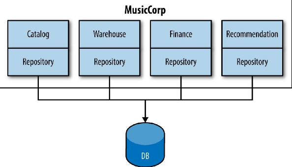

# Splitting the Monolith

We’ve discussed what a good service looks like, and why smaller servers may be better for us. We also previously discussed the importance of being able to evolve the design of our systems. But how do we handle the fact that we may already have a large number of codebases lying about that don’t follow these patterns? How do we go about decomposing these monolithic applications without having to embark on a big-bang rewrite?

The monolith grows over time. It acquires new functionality and lines of code at an alarming rate. Before long it becomes a big, scary giant presence in our organization that people are scared to touch or change. But all is not lost! With the right tools at our disposal, we can slay this beast.

## It’s All About Seams

We want our services to be highly cohesive and loosely coupled. The problem with the monolith is that all too often it is the opposite of both. Rather than tend toward cohesion, and keep things together that tend to change together, we acquire and stick together all sorts of unrelated code. Likewise, loose coupling doesn’t really exist: if I want to make a change to a line of code, I may be able to do that easily enough, but I cannot deploy that change without potentially impacting much of the rest of the monolith, and I’ll certainly have to redeploy the entire system.

In his book Working Effectively with Legacy Code (Prentice-Hall), Michael Feathers defines the concept of a seam — that is, a portion of the code that can be treated in isolation and worked on without impacting the rest of the codebase. We also want to identify seams. But rather than finding them for the purpose of cleaning up our codebase, we want to identify seams that can become service boundaries.

So what makes a good seam? Well, as we discussed previously, bounded contexts make excellent seams, because by definition they represent cohesive and yet loosely coupled boundaries in an organization. So the first step is to start identifying these boundaries in our code.

Most programming languages provide namespace concepts that allow us to group similar code together. Java’s package concept is a fairly weak example, but gives us much of what we need. All other mainstream programming languages have similar concepts built in, with JavaScript very arguably being an exception.

## Breaking Apart MusicCorp

Imagine we have a large backend monolithic service that represents a substantial amount of the behavior of MusicCorp’s online systems. To start, we should identify the high-level bounded contexts that we think exist in our organization. Then we want to try to understand what bounded contexts the monolith maps to. Let’s imagine that initially we identify four contexts we think our monolithic backend covers:

- Catalog: Everything to do with metadata about the items we offer for sale
- Finance: Reporting for accounts, payments, refunds, etc.
- Warehouse: Dispatching and returning of customer orders, managing inventory levels, etc.
- Recommendation: Our patent-pending, revolutionary recommendation system, which is highly complex code written by a team with more PhDs than the average science lab

The first thing to do is to create packages representing these contexts, and then move the existing code into them. With modern IDEs, code movement can be done automatically via refactorings, and can be done incrementally while we are doing other things. You’ll still need tests to catch any breakages made by moving code, however, especially if you’re using a dynamically typed language where the IDEs have a harder time of performing refactoring. Over time, we start to see what code fits well, and what code is left over and doesn’t really fit anywhere. This remaining code will often identify bounded contexts we might have missed!

During this process we can use code to analyze the dependencies between these packages too. Our code should represent our organization, so our packages representing the bounded contexts in our organization should interact in the same way the real-life organizational groups in our domain interact. For example, tools like Structure 101 allow us to see the dependencies between packages graphically. If we spot things that look wrong — for example, the warehouse package depends on code in the finance package when no such dependency exists in the real organization — then we can investigate this problem and try to resolve it.

This process could take an afternoon on a small codebase, or several weeks or months when you’re dealing with millions of lines of code. You may not need to sort all code into domain-oriented packages before splitting out your first service, and indeed it can be more valuable to concentrate your effort in one place. There is no need for this to be a big-bang approach. It is something that can be done bit by bit, day by day, and we have a lot of tools at our disposal to track our progress.

So now that we have our codebase organized around these seams, what next?

## The Reasons to Split the Monolith

Deciding that you’d like a monolithic service or application to be smaller is a good start. But I would strongly advise you to chip away at these systems. An incremental approach will help you learn about microservices as you go, and will also limit the impact of getting something wrong (and you will get things wrong!). Think of our monolith as a block of marble. We could blow the whole thing up, but that rarely ends well. It makes much more sense to just chip away at it incrementally.

So if we are going to break apart the monolith a piece at a time, where should we start? We have our seams now, but which one should we pull out first? It’s best to think about where you are going to get the most benefit from some part of your codebase being separated, rather than just splitting things for the sake of it. Let’s consider some drivers that might help guide our chisel.

## Tangled Dependencies

The other point to consider when you’ve identified a couple of seams to separate is how entangled that code is with the rest of the system. We want to pull out the seam that is least depended on if we can. If you can view the various seams you have found as a directed acyclical graph of dependencies (something the package modeling tools I mentioned earlier are very good at), this can help you spot the seams that are likely going to be harder to disentangle.

This brings us to what is often the mother of all tangled dependencies: the database.

### The Database

We’ve already discussed at length the challenges of using databases as a method of integrating multiple services. As I made it pretty clear earlier, I am not a fan! This means we need to find seams in our databases too so we can split them out cleanly. Databases, however, are tricky beasts.

## Getting to Grips with the Problem

The first step is to take a look at the code itself and see which parts of it read from and write to the database. A common practice is to have a repository layer, backed by some sort of framework like Hibernate, to bind your code to the database, making it easy to map objects or data structures to and from the database. If you have been following along so far, you’ll have grouped our code into packages representing our bounded contexts; we want to do the same for our database access code. This may require splitting up the repository layer into several parts, as shown here

Having the database mapping code colocated inside the code for a given context can help us understand what parts of the database are used by what bits of code. Hibernate, for example, can make this very clear if you are using something like a mapping file per bounded context.

This doesn’t give us the whole story, however. For example, we may be able to tell that the finance code uses the ledger table, and that the catalog code uses the line item table, but it might not be clear that the database enforces a foreign key relationship from the ledger table to the line item table. To see these database-level constraints, which may be a stumbling block, we need to use another tool to visualize the data. A great place to start is to use a tool like the freely available SchemaSpy, which can generate graphical representations of the relationships between tables.

All this helps you understand the coupling between tables that may span what will eventually become service boundaries. But how do you cut those ties? And what about cases where the same tables are used from multiple different bounded contexts? Handling problems like these is not easy, and there are many answers, but it is doable.

## Summary

We decompose our system by finding seams along which service boundaries can emerge, and this can be an incremental approach. By getting good at finding these seams and working to reduce the cost of splitting out services in the first place, we can continue to grow and evolve our systems to meet whatever requirements come down the road. As you can see, some of this work can be painstaking. But the very fact that it can be done incrementally means there is no need to fear this work.

So now we can split our services out, but we’ve introduced some new problems too. We have many more moving parts to get into production now! So next up we’ll dive into the world of microservices!!
