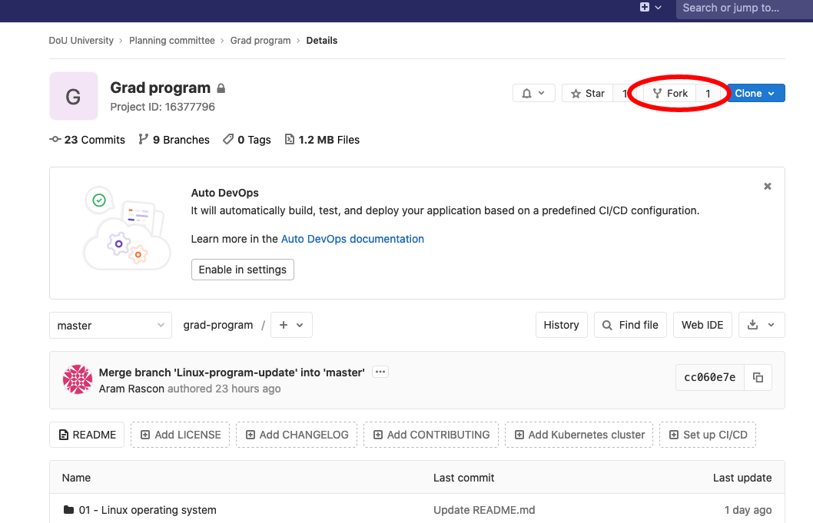

# Grad program
Join us in this journey so you can get up to speed with basic core DevOps technologies in just a few weeks. 

## Index
- [How to collaborate](#how-to-collaborate)
- [How to learn with this repo](#how-to-learn-with-this-repo)
- [Send your activities submissions](#send-you-activities-submissions)

## How to collaborate
If you want to make a collaboration for this repo, follow along the instructions [here](./collaborate.md)

## How to learn with this repo
### Fork this repo
Take this repo with you and begin your training.


### Sync this repo
Beware. This repository is alive! Check for updates before starting a lesson in your fork.

#### Add original repo as upstream
If you don't have upstream setup, use the remote add feature, there's no need to do this each time you want to sync the repo.
```Shell
$ git remote add upstream git@gitlab.com:dou-university/planning-committee/grad-program.git
```

#### Fetch upstream
```shell
$ git fetch upstream master
```

#### Checkout master
```shell
$ git checkout master
```

#### Merge any pulled changes to your local fork
```shell
$ git merge upstream/master
```

#### Push updates
```shell
$ git push origin master
```

### Send your activities submissions
Open up a merge request in your forked repo and assign the corresponding instructor for each topic.

| Topic | Instructor | GitLab user |
| ----------- |-------------| -------|
| 01 - Linux operating system   | Juan Carlos Perez | [@jcph](https://gitlab.com/jcph) |
| 02 - Git   | Aram Rascón | [@aram-cuu](https://gitlab.com/aram-cuu) |
